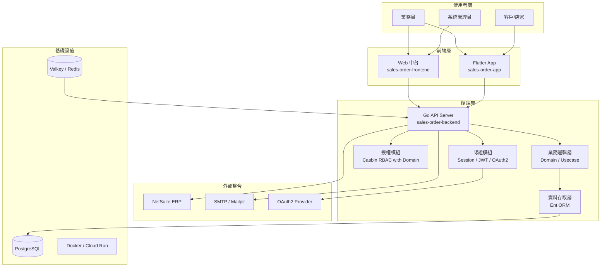
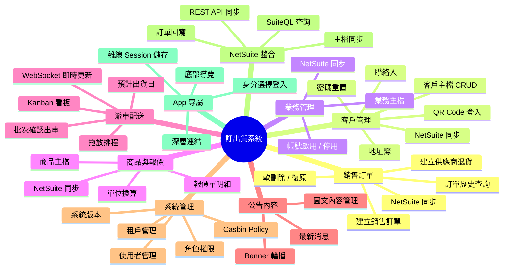
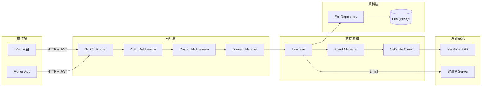

# 訂出貨系統 — 功能列表與架構說明

> 本文件統整 `sales-order-backend`、`sales-order-frontend`、`sales-order-app` 三個子專案的功能清單、系統架構圖與功能心智圖。

---

## 1. 專案概覽

| 子專案 | 技術 | 用途 |
|--------|------|------|
| `sales-order-backend` | Go 1.25 + Ent + Chi + PostgreSQL | RESTful API 後台服務 |
| `sales-order-frontend` | SolidJS 1.9 + TypeScript 5.9 + Vite 6 | 網頁中台（SPA） |
| `sales-order-app` | Flutter 3.35.2 | 跨平台行動 App |

**主要使用者角色**：
- `super` / `admin`：系統管理員
- `acct`：會計
- `sales`：業務員
- `customer`：客戶（店家）

---

## 2. 系統架構圖

---

## 3. 功能心智圖

---

## 4. 功能列表

### 4.1 認證與授權

| 功能 | 說明 | 適用端 |
|------|------|--------|
| 業務員登入 | 使用 email + 密碼登入，未驗證帳號引導設定密碼 | Web / App |
| 客戶登入 | 使用 entity_id + 密碼登入 | App |
| QR Code 快速登入 | 客戶透過 `/customer_account_qrcode/:id` 深層連結直接帶入帳號 | App |
| 首次設定密碼 | 新帳號首次登入時強制設定密碼 | Web / App |
| 密碼重置 | 管理員可清除/重置客戶或業務密碼 | Web |
| Session Cookie 認證 | 基於 `scs` 的 PostgreSQL session store | Web |
| API JWT Token | `X-Sowinsoft-Token` 用於前端與 App 的 API 認證 | Web / App |
| OAuth2 登入 | 支援 Google OAuth2 callback | 後端 |
| 強制登出 | 管理員可強制指定使用者登出 | Web |
| Casbin RBAC | 以 role + tenant（domain）+ path + method 做授權 | 後端 |
| 角色管理 | super / admin / acct / sales / guest 角色設定 | 後端 / Web |
| 權限原則管理 | 新增 / 刪除 / 查詢 Casbin policy | 後端 / Web |

### 4.2 銷售訂單管理

| 功能 | 說明 | 適用端 |
|------|------|--------|
| 銷售訂單建立 | 選擇客戶、業務、部門、商品明細，同步寫入 NetSuite | Web / App |
| 供應商退貨授權 | 建立 `vendorreturnauthorization` 類型訂單 | Web |
| 訂單列表查詢 | 分頁、篩選、排序訂單資料 | Web / App |
| 訂單明細查看 | 查看訂單項目、數量、單價、稅率、備註等 | Web / App |
| 訂單軟刪除 | 標記 `deleted_at` 軟刪除，可復原 | Web |
| 訂單復原 | 將軟刪除訂單恢復 | Web |
| NetSuite 同步 | 依日期區間增量同步 NetSuite 訂單 | Web |
| 商品明細編輯 | 代切實重肉片、切法、數量、單位、單價、備註 | Web / App |
| 單位換算 | 依商品單位類型自動換算數量 | Web / App |
| 報價帶入 | 根據客戶與業務帶出歷史 Estimate 報價項目 | Web / App |
| 訂單建立通知 | 建立成功後發送 email 通知業務員 | 後端 |

### 4.3 客戶管理

| 功能 | 說明 | 適用端 |
|------|------|--------|
| 客戶主檔 CRUD | 公司名稱、統編、電話、客戶類型、付款條件等 | Web / App |
| 地址簿管理 | 多筆送貨/帳單/居住地址，可設預設 | Web / App |
| 聯絡人管理 | 多筆聯絡人資料（稱呼、職稱、Email、電話） | Web / App |
| 客戶軟刪除 / 復原 | 標記刪除與恢復 | Web |
| NetSuite 同步 | 同步 NetSuite customer 主檔 | Web |
| QR Code 產生 | 產生客戶專屬登入 QR Code，可下載/分享 | Web / App |
| 客戶篩選 | 依部門、關鍵字搜尋客戶 | Web / App |
| 重置客戶密碼 | 管理員清除客戶 App 登入密碼 | Web / App |

### 4.4 業務員管理

| 功能 | 說明 | 適用端 |
|------|------|--------|
| 業務主檔列表 | 查看業務員基本資料 | Web |
| 更新業務資料 | 修改業務員資訊 | Web |
| 業務軟刪除 / 復原 | 標記刪除與恢復 | Web |
| NetSuite 同步 | 同步 NetSuite salesrep 主檔 | Web |
| 業務選項服務 | 提供訂單/客戶表單所需的業務下拉選項 | Web / App |

### 4.5 商品與報價管理

| 功能 | 說明 | 適用端 |
|------|------|--------|
| 商品主檔列表 | 品項、部門、單位類型、最大數量等 | Web |
| 商品軟刪除 / 復原 | 標記刪除與恢復 | Web |
| NetSuite 同步 | 同步 NetSuite item 主檔 | Web |
| 報價單明細列表 | NetSuite Estimate 交易明細 | Web |
| 報價日期篩選 | 依交易日期與報價有效日期篩選 | Web |
| 報價帶入訂單 | 在訂單表單快速選擇歷史報價項目 | Web / App |

### 4.6 派車配送管理

| 功能 | 說明 | 適用端 |
|------|------|--------|
| Kanban 看板 | 以車次為欄位，訂單為卡片的看板 | Web |
| 拖放排程 | 卡片可跨車次拖曳，車次欄可排序 | Web |
| 批次更新派車 | 一次 upsert 多筆派車單 | Web |
| 派車確認 | 確認出車並將狀態寫回 NetSuite | Web |
| 日期篩選 | 依預計出貨日查看當日配送 | Web |
| WebSocket 即時更新 | 派車資料變更時即時推播前端 | Web |
| Server-Sent Events | 派車看板 SSE 即時串流 | Web |
| 預計出貨日設定 | 設定訂單預計出貨日期 | Web / App |

### 4.7 字典檔管理（Metadicts）

| 功能 | 說明 | 適用端 |
|------|------|--------|
| 字典列表 | 單位、幣別、付款條件、車次、結帳方式、付款方式、客戶類型、發票類型、訂單來源、代切實重肉片、規格、簽核狀態等 | Web |
| NetSuite 同步 | 全量同步 NetSuite 自定義列表與參考資料 | Web |
| 軟刪除 / 復原 | 標記刪除與恢復 | Web |
| 選項服務 | 為各業務表單提供下拉選項 | Web / App |

### 4.8 公告 / 內容管理

| 功能 | 說明 | 適用端 |
|------|------|--------|
| 文章 CRUD | 標題、內容、slug、圖片、連結、分類、標籤 | Web |
| Banner 輪播 | App 首頁焦點新聞輪播 | App |
| 最新消息列表 | App 首頁卡片式新聞列表 | App |
| 圖片上傳 | WebP Base64 圖片處理 | Web |
| 平台與語言 | 設定文章適用平台與語言 | Web |

### 4.9 系統管理

| 功能 | 說明 | 適用端 |
|------|------|--------|
| 使用者管理 | 中台使用者 CRUD | Web（後端就緒） |
| 租戶管理 | 多租戶 CRUD | Web（後端就緒） |
| 角色權限管理 | 角色與 policy 綁定 | Web（後端就緒） |
| 系統版本查詢 | 取得後端 API 版本 | Web |
| CSRF Token | 取得受保護操作的 CSRF token | Web |
| 全量同步觸發 | 觸發所有 NetSuite 主檔全量同步 | Web |
| Email 測試 | 測試 SMTP 發信 | 後端 |

### 4.10 App 專屬功能

| 功能 | 說明 |
|------|------|
| 身分選擇 | 進入 App 時選擇「我是店家」或「我是業務」 |
| 底部導覽 | 首頁、商品、訂單歷史、功能四個頁籤 |
| 深層連結 | `/customer_account_qrcode/:customerAccount` 自動帶入帳號 |
| 本地 Session 儲存 | Sembast 持久化 session、cookies、HTTP cache |
| 圖片快取 | Base64 圖片記憶體快取 |
| 下拉重新整理 | 首頁、訂單歷史、客戶列表支援 pull-to-refresh |
| 開發日誌 | Talker 網路與 App 日誌 |
| 外部連結開啟 | 公告、隱私權政策、關於我們 |
| Wolt Modal Sheet | 客戶新增/編輯/QR Code 的 Modal 頁面 |
| 主題與樣式 | 統一顏色、字體、主題管理 |

### 4.11 Web 中台專屬功能

| 功能 | 說明 |
|------|------|
| 側邊欄導覽 | 分「基本資料」、「業務功能」、「系統功能」三群組 |
| 麵包屑 | 自動根據路由產生中文麵包屑 |
| 主題切換 | Light / Dark / System |
| DataTable | 分頁、排序、欄位隱藏、篩選、批次操作 |
| Sheet 表單 | 側邊滑出新增/編輯表單 |
| Cmd+K 搜尋 | 頂部搜尋列（預留） |
| 通知鈴 | 頂部列通知按鈕（預留） |
| 版本顯示 | 側邊欄顯示前端與後端版本 |

---

## 5. 資料流架構圖

---

## 6. 各端功能對照表

| 功能 | 後端 | Web 中台 | App |
|------|:--:|:--:|:--:|
| 業務登入 | ✅ | ✅ | ✅ |
| 客戶登入 | ✅ | — | ✅ |
| QR Code 登入 | ✅ | 產生 QR | 掃描/深層連結 |
| 銷售訂單建立 | ✅ | ✅ | ✅ |
| 訂單歷史查詢 | ✅ | ✅ | ✅ |
| 客戶管理 | ✅ | ✅ | ✅（業務） |
| 業務管理 | ✅ | ✅ | — |
| 商品管理 | ✅ | ✅ | 下拉選項 |
| 報價單明細 | ✅ | ✅ | 下拉選項 |
| 派車看板 | ✅ | ✅ | — |
| 字典檔管理 | ✅ | ✅ | 下拉選項 |
| 公告內容 | ✅ | ✅ | ✅ |
| 角色權限 | ✅ | 後端就緒 | — |
| 使用者管理 | ✅ | 後端就緒 | — |
| NetSuite 同步 | ✅ | ✅ | — |
| 系統版本 | ✅ | ✅ | — |

---

## 7. 技術特色

- **多租戶 RBAC**：以 tenant 為 domain 的 Casbin 授權模型
- **事件驅動同步**：透過 event manager 觸發 NetSuite 各主檔同步
- **即時派車看板**：WebSocket + SSE 雙軌即時推播
- **軟刪除機制**：多數業務表支援 `deleted_at` 與復原
- **離線優先 App**：Sembast 本地儲存 session、cookies、HTTP cache
- **深層連結整合**：QR Code 串接客戶登入體驗
- **型別同步**：後端透過 tygo 產生前端 TypeScript 型別

---

*最後更新：2026-07-16*
