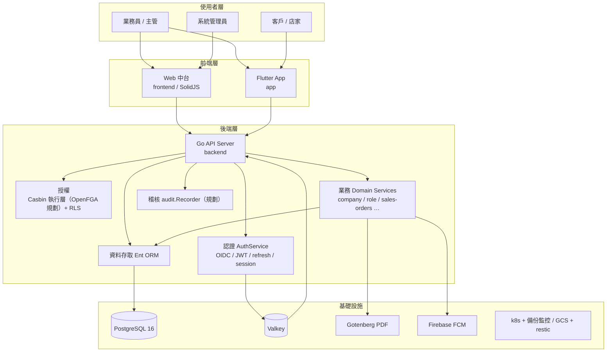

# 多公司訂出貨系統 1.0 — 功能列表與架構說明

> **本版為「多公司訂出貨系統 1.0」全新 monorepo 的功能列表**（取代先前描述舊三倉系統 `sales-order-backend` / `-frontend` / `-app` 的舊版；舊版功能含 NetSuite 同步、Session cookie、SSE 派車看板等，已不適用 1.0 規劃）。
>
> 1.0 為全新 monorepo（`backend/` + `frontend/` + `app/`），**不遷移舊資料、不沿用舊碼**。本文件以 `docs/PLANNING_OVERVIEW.md`（§3 In Scope/Out of Scope）與 `docs/superpowers/specs/2026-07-16-sales-order-1.0-design.md`（v1.0.34）為範圍權威；**實際已實作**標記以 2026-09-18 codebase-memory 盤點為準。

---

## 1. 專案概覽

| 子專案 | 技術 | 用途 |
|--------|------|------|
| `backend/` | Go 1.25 + Ent + Chi + Connect-RPC + PostgreSQL + Valkey + Gotenberg | API 後台（Connect-RPC 為業務 API 唯一來源） |
| `frontend/` | SolidJS 1.9 + TypeScript + Vite | 網頁中台（SPA） |
| `app/` | Flutter（Dart ≥3.10）+ solidart + disco + auto_route + fquery + Sembast | 跨平台行動 App |

**主要使用者角色**：`super` / `company_admin` / `dept_admin` / `staff`（兼會計）/ `customer` / `guest` / `developer`（逃生門）。

**主要決策（D1–D32 摘要）**：
- D1/Big Bang、D3 租戶隔離（OpenFGA 規劃 + PostgreSQL RLS；CASL 移除由 D32 修訂）、D4 Connect-RPC 唯一 API、D5 認證雙軌（Web 無證 / App JWT+refresh）、D7 樂觀鎖取號、D12 不存金額、D13 訂單狀態機、D14 派車串流（Connect stream、Valkey pub/sub）、D15 四種單據 PDF、D16 通知兩通道（FCM+站內，無 Email）、D21 三端覆蓋率 70%、D27 稽核保留、D29 App 技術棧、D32 Fleetbase 執行層（OpenFGA+RLS）。

---

## 2. 系統架構圖

> 架構依 1.0 規劃；NetSuite 整合（舊三倉）已移除。

---

## 3. 現況實作對照（2026-09-22）

| 層 | 實際已實作 | 待辦 |
|---|---|---|
| backend | AuthService（登入/refresh/logout/註冊完成/ChangePassword/ResetCustomerPassword）、AbilityService（OpenFGA proxy）、Company/Department（皆軟刪除）/RoleService、UserService（7 RPC＋範圍控制＋稽核）、MetadictService、AuditService.List、CustomerService（含地址/聯絡人＋QR 簽章/`GetCustomerQRCode`）、ProductService（含單位換算）、部門級四主檔（Warehouse/Route/ProcessingSpec/ProductCategory）、CustomerProductService、SalesOrderService（CRUD＋狀態機 `TransitionOrder`＋取號＋事件軌跡）、ReturnService（Create／List／Get／Review／GetCertificate）、PrintService（Preview/Print/ListLogs）、`domain/fileassets`（驗證＋儲存＋REST 上傳下載＋公司 Logo 上傳 `POST /companies/{id}/logo`）、`GET /api/v1/me`（身分＋公司品牌）、OpenFGA 內嵌＋Provision、Casbin 執行層、RLS 全站 28 表 `ENABLE`+`FORCE`（請求層租戶交易 `dbtenant`）、JWT/session/token_version、audit.Recorder 同事務、Gotenberg PDF 產線 | 通知、派車、fleet；CASL→OpenFGA 收斂 |
| frontend | auth（Login 雙 tab/403/Google OIDC）、users（Company/Department/Roles/Users 四頁＋PermissionMatrix＋分頁＋表頭排序＋公司 Logo 上傳對話框（super，`POST /companies/{id}/logo`））、customers（清單/排序/關鍵字/含已刪除/軟刪除/帳號交付＋列上地址簿/聯絡人與專屬商品對話框，`/customers`）、orders（清單/篩選/建單/編輯/詳情明細/事件軌跡/狀態轉移，`/orders`＋商品下拉）、products（清單/篩選/建單/編輯/單位換算/軟刪除，`/products`＋分類/倉別下拉）、dispatch（看板依日後端過濾＋車次欄 DnD 指派＋批次確認＋取消派車＋WatchBoard 訂閱，`/dispatch`）、masters（車次/倉別/商品分類/分切規格四主檔清單/建立/編輯/停用/還原，`/masters/*`）、printing（四種單據預覽/正式列印/紀錄查詢＋重印原因，`/printing`）、returns（清單/狀態篩選/明細快照/核准駁回/退貨證明，`/returns`）、notifications（本人清單/未讀數/狀態與通道篩選/單列與整頁標記已讀，`/notifications`）、audit（起迄日/動作/資源篩選＋變更快照明細，`/audit`）、ability 守衛（`hasPermission` 權限集合，`@casl/ability` 已移除）、UI 元件庫（Ark UI × Tailkit 語意 token，14 元件＋registry＋demo）、app shell/sidebar/深色模式（側邊欄公司 Logo 顯示，`BrandLogo`＋`/me`）、TanStack Table（manual）＋solid-query 資料層、TanStack Form＋valibot 表單 | 公告；Pixso 剩餘未建畫面 |
| app | 骨架、雙 flavor、auth（身分選擇/登入/token/connectrpc transport）、auto_route 路由表 | solidart/disco/fquery/Sembast 佈線、core/config/errors、快取鏡像、業務畫面（客戶/訂單/退貨/QR） |

---

## 4. 功能列表（1.0 In Scope）
> 標記：✅ 已實作（2026-09-22）・⬜ 規劃/未開始・🟡 部分（後端已落地、前端頁面待）。

### 4.1 認證與授權（D5/D6）

| 功能 | 說明 | 適用端 | 狀態 |
|------|------|------|:-:|
| 員工 Google OIDC 登入 | Workspace OIDC 導向 + callback，首登註冊完成選公司 | Web/後端 | ✅ backend |
| 客戶帳密登入 | email + 密碼，5 次失敗鎖定 30 分鐘 | App | ✅ backend |
| Web session（無證） | scs + Valkey session | Web | ✅ backend |
| App JWT + refresh | access 1h + refresh 30d 旋轉 + token_version 撤銷 | App | ✅ backend |
| QR 登入 | 客戶子帳號 QR 深層連結 | App | 🟡（proto 有，兌換端點待） |
| 首登強制改密碼 | temp password 24h | Web/App/後端 | 🟡（後端 ChangePassword＋受限態＋效期已落地；Web/App 首登改密碼頁未做） |
| 強制登出 | 管理員撤銷指定使用者 | Web/後端 | 🟡（後端 `UserService.ForceLogout`＋token_version 已落地；Web 頁待） |
| AuthService 掛載 | Connect login/refresh/logout/registerComplete/qrLogin | 後端 | ✅ |
| Ability API | GetAbility 產 CASL JSON（表驅動） | 後端/Web/App | ✅ backend + Web |
| Casbin 執行層 | 7 內建角色 RBAC（執行層） | 後端 | ✅ |
| RLS | 資料範圍 all/company/department/self | 後端 | 🟡（policy 已定義於 00002/00007/00009/00013；**未 ENABLE/FORCE**，每請求交易 `SET LOCAL` 待） |
| developer 逃生門 | 7 內建角色繞過 | 後端 | ✅（`SeedDeveloper`＋`DEVELOPER_ACCOUNT_ENABLED`；production 誤開 fail-fast） |

### 4.2 多租戶與主檔（D3/D7/D10）

| 功能 | 說明 | 適用端 | 狀態 |
|------|------|------|:-:|
| Company CRUD | 公司主檔 + customer_code_prefix 唯一 | Web/後端 | ✅ backend + Web |
| Department CRUD | 部門 CRUD | Web/後端 | ✅ backend + Web |
| 使用者管理 | UserService CRUD、角色指派、停用連鎖 | Web/後端 | ✅（後端 7 RPC＋Web 頁） |
| Logo/Branding/PublicInfo | 公開資訊 + Logo 上傳 | Web/後端 | 🟡（PublicInfo＋Logo 上傳/顯示已落地：`POST /companies/{id}/logo`＋`GET /me`＋Web 上傳對話框/側邊欄；UpdateBranding／公開發現端點待） |
| roles + role_permissions | 7 角色 + 權限表（CASL 三欄） | 後端/Web | ✅ |
| 角色權限設置 | PermissionMatrix | Web | ✅ |
| 客戶主檔 | customers + 取號 + 建檔連動帳號（D22） | Web/App/後端 | 🟡（後端已落地含取號/D22 帳號交付；Web 清單/新增/編輯/軟刪除/帳號交付＋地址簿/聯絡人/專屬商品已落地；App 頁待） |
| 地址簿/聯絡人 | 多筆地址/聯絡人 | Web/App/後端 | ✅（後端 8 RPC；Web `183d205` 客戶列上「地址簿」對話框；App 頁待） |
| 商品主檔 | 商品 + 單位換算 + 分切規格 | Web/App/後端 | 🟡（後端三實體＋單位換算已落地；Web 清單/建單/編輯/單位換算/軟刪除已落地，分切規格關聯編輯待；App 頁待） |
| 倉別/車次/分類 CRUD | 部門級實體表 | Web/後端 | ✅（後端四主檔含 restore；Web 車次 `e950b23`＋倉別/分類/分切規格 `0a590d0`） |
| 客戶專屬商品 | 業務建立、別名機制 | Web/App/後端 | 🟡（後端已落地；Web `6192c13` 客戶列上「專屬商品」對話框（清單/新增/編輯/移除＋查詢式產品挑選器）已落地；App 頁待） |
| 檔案資產 | FileStore 本地儲存白名單＋REST 上傳下載 | Web/後端 | ✅（後端＋REST；消費面：09 列印 PDF、02 Logo 上傳 Web 對話框；檔案無獨立頁，皆經 owner 入口） |

### 4.3 銷售訂單（D7/D12/D13/D26）

| 功能 | 說明 | 適用端 | 狀態 |
|------|------|------|:-:|
| 訂單建立/CRUD | 訂單明細、狀態機、事件軌跡 | Web/App/後端 | 🟡（後端＋Web 清單/建單/編輯/詳情/事件/狀態轉移已落地；App 頁待） |
| 樂觀鎖取號 | order_no 來源碼 + 6 位自增 | 後端 | ✅ |
| 訂單狀態機 | pending⇄processing→completed / cancelled / voided | 後端 | ✅ |
| 手打商品別名 | 綁定客戶的手打品名 | Web/App/後端 | 🟡（後端已落地；Web/App 頁待） |
| 客戶專屬清單守衛 | 下單從客戶專屬清單帶入 | Web/App/後端 | 🟡（後端已落地；Web/App 頁待） |
| 偏好送貨日 | preferred_delivery_days 順延（D26） | 後端 | 🟡（欄位已落地；順延排程待） |
| 不存金額 | 訂單/明細/商品無金額欄位（D12） | 全端 | — 規約 |

### 4.4 退貨（D25）

| 功能 | 說明 | 適用端 | 狀態 |
|------|------|------|:-:|
| 退貨申請 | 客戶發起（歷史訂單/專屬並存） | App/後端 | 🟡（後端 `CreateReturnRequest` 已落地；App 畫面待） |
| 業務審核 | approved/rejected、不修改原訂單 | Web/後端 | ✅（後端 `ReviewReturnRequest` 樂觀鎖＋稽核；Web `549933c`） |
| 退貨證明 | GetCertificate 資料輸出 | 後端 | ✅（唯讀快照，僅 approved 可出示） |
| 審核推播 | 通知發起帳號（D23） | 後端 | 🟡（同交易建 pending＋提交後發送已接 07；FCM 發送仍為 Fake，實裝另案） |

### 4.5 派車看板（D13/D14）

| 功能 | 說明 | 適用端 | 狀態 |
|------|------|------|:-:|
| Kanban 拖放 | AssignRoute 樂觀鎖 + 順位重排 | Web/後端 | ✅（Web `e3ed769`） |
| 批次確認 | 車次 Confirm（部分失敗語義） | Web/後端 | ✅（Web `e3ed769`） |
| 取消派車 | dept_admin + 原因 + 重印警告 | Web/後端 | ✅（Web `e3ed769`） |
| WatchBoard 串流 | Connect server streaming + Valkey pub/sub + 輪詢降級（D14） | Web/後端 | 🟡（串流兩端已接：Web 訂閱＋收到事件即重查；跨 replica Valkey pub/sub 與輪詢降級待） |

### 4.6 單據列印（D15）

| 功能 | 說明 | 適用端 | 狀態 |
|------|------|------|:-:|
| 四種單據 PDF | 單車總表/對點單/揀貨單/加工單（Gotenberg、無金額） | Web/後端 | ✅（Web `13c76f4`） |
| Preview / Print / ListLogs | 列印與預覽 API、重印必填原因 | Web/後端 | ✅（Web `13c76f4`） |

### 4.7 通知與公告（D16/D23/D24）

| 功能 | 說明 | 適用端 | 狀態 |
|------|------|------|:-:|
| 通知兩通道 | FCM + 站內（無 Email），失敗不重試 | 後端 | 🟡（站內＋Failmark 已落地；FCM 實裝另案） |
| 通知中心 | 本人清單、未讀數、狀態/通道篩選、單列與整頁標記已讀 | Web/後端 | ✅（後端 List／MarkRead／UnreadCount；Web `b193544`） |
| 下單推播 | 業務下單推客戶子帳號 | 後端 | ✅（07 Task 5 已接 05 建單，同交易建 pending＋提交後發送） |
| 促銷推播 | promo_tags 分類標籤選群（D24） | 後端 | ⬜ |
| 公告 CMS | 公告內容管理（與促銷分離） | Web/後端 | ⬜ |

### 4.8 稽核與維運（D18/D19/D27）

| 功能 | 說明 | 適用端 | 狀態 |
|------|------|------|:-:|
| 稽核日誌 | 關鍵操作同事務寫入、保留 1/3/6/12 月或永久 | Web/後端 | ✅（後端 `AuditService.List`（D27 近 3 月預設窗）＋Web `834f575`） |
| k8s 部署 + 備份 | StatefulSet + PITR + Prometheus/Grafana | 維運 | ⬜ |

### 4.9 App 專屬（D29）

| 功能 | 說明 | 適用端 | 狀態 |
|------|------|------|:-:|
| 身分選擇登入 | 店家 / 業務身分選擇 | App | ✅ |
| 登入/token | connectrpc 客戶端 + secure storage token | App | ✅ |
| auto_route 路由 | 路由表（login/identity_select） | App | ✅ |
| 底部導覽 / 深層連結 | 首頁/商品/訂單/QR 深層連結 | App | ⬜ |
| 離線快取 | Sembast 唯讀鏡像 + fquery | App | ⬜（未落地） |

### 4.10 Web 中台專屬

| 功能 | 說明 | 狀態 |
|------|------|:-:|
| 側邊欄導覽 / 麵包屑 / 主題 | 中台外殼 | ✅（sidebar 多部件＋AppShell＋深色模式三態＋anti-FOUC；麵包屑待各業務頁） |
| DataTable / Sheet | 分頁、排序、篩選、側滑表單 | ✅（TanStack Table manual＋伺服器端排序＋modal 表單；篩選待 domain） |
| Cmd+K 搜尋 / 通知鈴 | 預留 | ⬜ |

---

## 5. 對照表（1.0 現況）

| 功能 | backend | Web | App |
|------|:--:|:--:|:--:|
| 登入 / 認證 | ✅ | ✅ | ✅ |
| 公司 / 部門 CRUD | ✅ | ✅ | — |
| 角色權限 + PermissionMatrix | ✅ | ✅ | — |
| 使用者管理 | ✅（API） | ✅ | — |
| 客戶 / 地址 / 商品 / 部門級主檔 | ✅（API） | ✅（客戶 `206192a`＋商品 `61feab2`＋地址簿 `183d205`＋車次 `e950b23`＋倉別/分類/分切規格 `0a590d0`） | ⬜ |
| 客戶專屬商品 | ✅（API） | ✅（`6192c13`） | ⬜ |
| 檔案資產 | ✅（API） | ⬜ | ⬜ |
| 銷售訂單 | ✅（API） | ✅（`6953b02`） | ⬜ |
| 退貨 | ✅（API） | ✅（`549933c`） | ⬜ |
| 派車看板 | 🟡（4 RPC＋WatchBoard 串流已落地；跨 replica Valkey pub/sub 與輪詢降級待） | ✅（`e3ed769`） | — |
| 列印 | ✅（API） | ✅（`13c76f4`） | — |
| 通知 / 公告 | 🟡（通知後端約 85%；公告待） | ✅（通知中心 `b193544`；公告待） | ⬜ |
| 稽核 | ✅（查詢 API） | ✅（`834f575`） | — |
| **RLS 租戶隔離（資料層）** | ✅（32 表 `ENABLE`+`FORCE`、請求層租戶交易；2026-09-22） | — | — |

---

## 6. 技術特色（1.0）

- **Connect-RPC 唯一 API**：proto `v1` 產生三端型別（D4）
- **雙重授權**：OpenFGA 內嵌（`OPENFGA_ENABLED=true` fail-fast；role_permissions→tuple 供給，tuple 同步於 DB commit 後執行）＋ Casbin 執行層 fallback ＋ PostgreSQL **RLS 資料範圍（32 張業務表已 `ENABLE`+`FORCE`，2026-09-22；白名單探針 32 項；記錄類僅追加、業務實體 CRUD 全授、通知範本/通知無 DELETE）**；請求層租戶交易（`dbtenant`：每 unary RPC 一交易、`SET LOCAL app.*` 套 scope、稽核同交易 D18）＋ 服務層 role+scope（D33） |
- **認證雙軌**：Web 無證 session／App JWT+refresh＋token_version 撤銷（D5）
- **樂觀鎖取號**：全部自增編號同事務取號（D7）
- **不存金額**：訂單/明細/商品無金額（D12）
- **派車串流**：Connect server streaming + Valkey pub/sub（D14，WS 已廢除）
- **通知雙通道**：FCM + 站內、無 Email（D16）
- **測試覆蓋率 70%**：三端 CI 強制（D21）

---

*最後更新：2026-09-22（backend 01–09 後端全數落地（07/08 部分：FCM 實裝＋跨 replica＋Web/App 頁待）＋RLS 32 表；全整合綠；前端使用者管理頁 `8caae63`＋客戶主檔頁 `206192a`＋訂單管理頁 `6953b02`＋商品總表頁 `61feab2`＋派車看板 `e3ed769` 落地（含 `ListOrders` 日期過濾前置）＋車次主檔 `e950b23`（看板欄位來源）＋單據列印頁 `13c76f4`，UI 四階段與表格/表單既有）*
