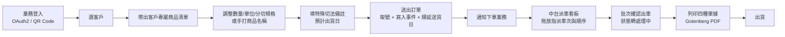
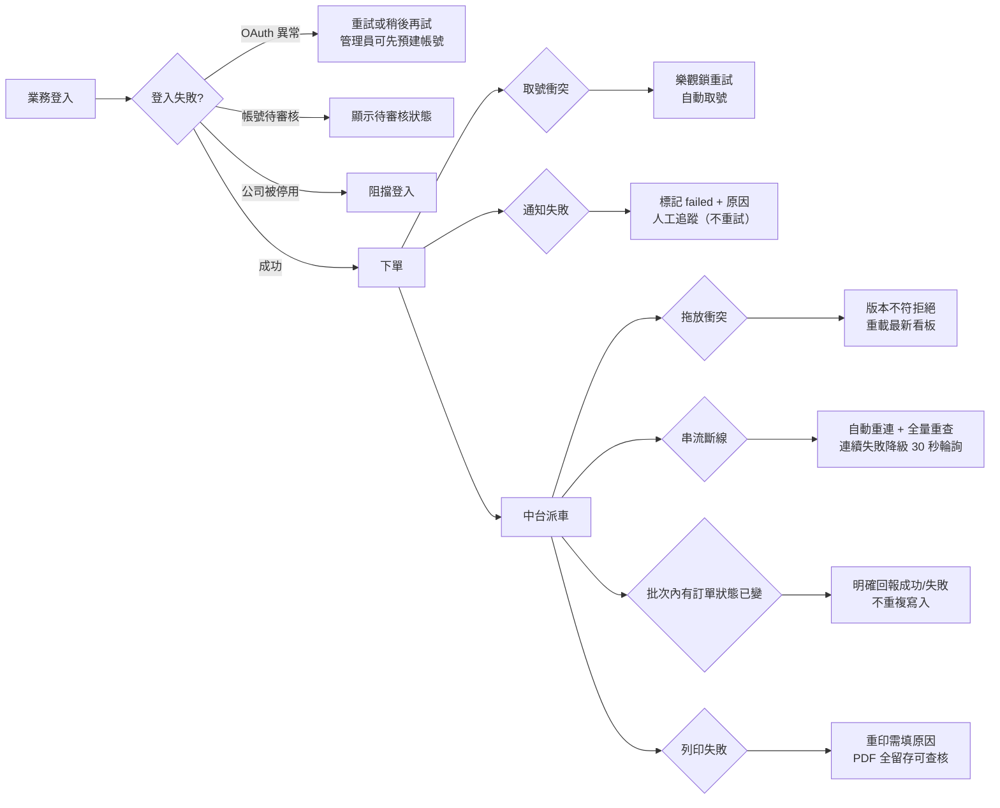
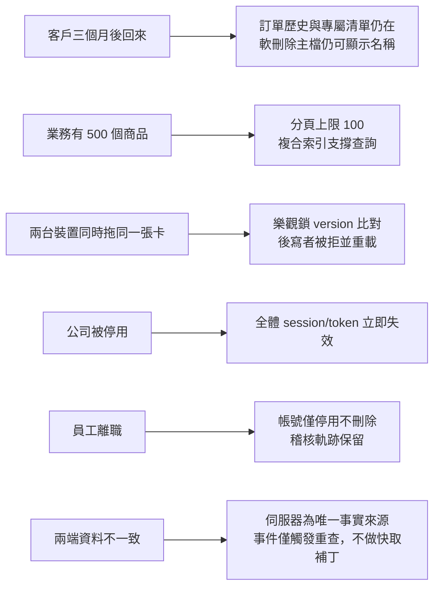
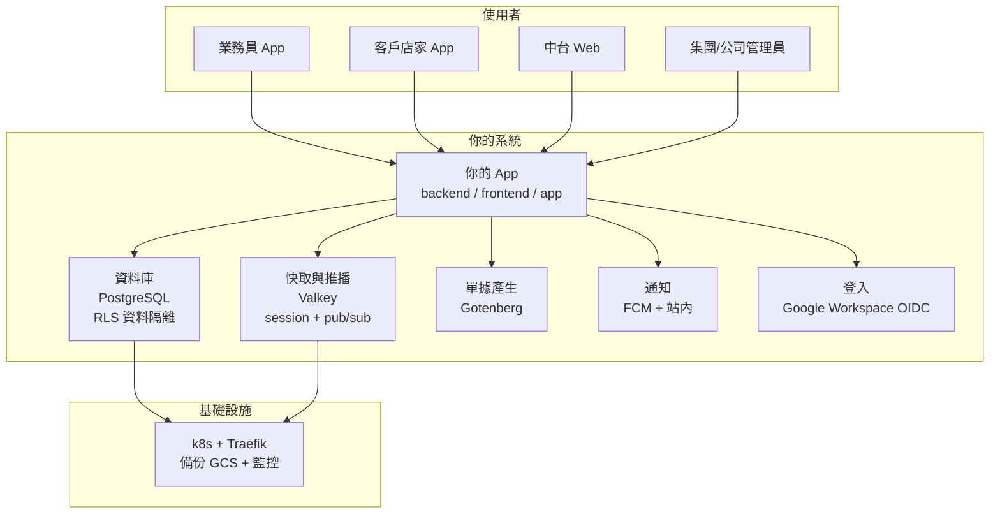

# 多公司訂出貨系統 1.0 — 建置計畫（vibe-check 重整版）

> 本計畫以 vibe-check 結構重整既有規劃（來源：客戶版規格書 v1.0.34、執行計畫 v2.9.0、決策記錄 D1–D28、需求規格 12 份、客戶需求.txt、需求備忘_2026-08-03）。是交給 AI 建置工具的完整說明書，也是後續每個建置階段的檢查基準。
> 日期：2026-08-03　複雜度：**7 / 10**（待辦清單 2、Instagram 9；這是三端 + 基礎設施的 B2B 系統重建）

---

## 1. 問題（The Problem）

業主與業務的原話（`docs/客戶需求.txt`）：

> 「產品分庫，揀貨單會顯示庫別」「產品名稱手打+清單選擇都留」「APP端業務可以直接刪除品項」「手寫備註欄（特殊切法）」
> 「各部門資料庫分隔檢視 僅總管理員可調閱全部資料」「商品總表由各部門自行建立」「客戶要有其專屬商品清單…可以手動刪除不要的品項」
> 「拉(到)客戶訂單上時要可讓業務手動修改商品名且綁定該客戶…A商品會在總表上叫做A但同時會在不同客戶叫做BCDEF」

現狀的病根：**主檔（客戶、商品、業務、報價）掌握在外部系統手裡，系統無法自建管理**；集團多公司、多部門之間沒有權限隔離；倉儲（庫別）、派車與單據列印流程靠人工拼湊。業務要下單、要印揀貨單，得在幾個系統與紙本之間來回。

## 2. 願景（The Vision）

一套讓集團各公司自己管自己、總管理員看得到全部的系統：

- **業務**：App 選客戶 → 客戶專屬商品清單直接帶出 → 改數量、改單位、手打品名、寫特殊切法 → 30 秒完成下單。
- **中台**：派車看板拖放排車、一次確認一車次、四種單據（單車總表/對點單/揀貨單/加工單）一鍵列印。
- **客戶**：QR Code 掃一下登入，只能看到自己的商品與訂單。
- **總管理員**：跨公司調閱全部；部門管理員只看自己部門；誰做了什麼都有稽核。

## 3. 目標（The Goal）

- **要達成的事**：取代外部系統依賴，把「下單 → 派車 → 列印 → 出貨」整條營運流程收進一套自建系統，主檔全部自己掌握。
- **現在怎麼做**：靠外部系統（NetSuite）提供主檔 + 現行三倉系統（`sales-order-backend/frontend/app`）+ 人工單據作業。
- **為什麼糟**：主檔不能自建、部門資料無法隔離、揀貨/加工單靠人工拼湊；集團擴張時每加一家公司就要重來一次。
- **怎麼算成功**：「業務用 App 完成一筆訂單、中台完成派車與四種單據列印、全程不碰外部系統」能在 10 分鐘內走完。

## 4. 使用者（Who It's For）

| 角色 | 說明 | 使用端 |
|---|---|---|
| `super` 集團管理 | 跨公司調閱、建立公司、維護系統級字典 | Web |
| `company_admin` 公司管理 | 自己公司跨部門、審核 guest、維護公司識別 | Web |
| `dept_admin` 部門管理 | 自己部門的帳號與主檔、取消派車、作廢 | Web + App |
| `staff` 業務（兼會計檢視） | 下單、建客戶、重印單據 | App 為主 + Web |
| `customer` 客戶店家 | 用自己的專屬商品清單下單、查歷史 | App |
| `guest` 待審核 | 首次 OAuth 登入後等待審核 | Web/App |
| `developer` 開發逃生門 | 跨租戶除錯（環境開關控制，prod 關閉） | — |

預期規模：首波 1–2 家公司上線（Big Bang），數十名業務、數百間店家；之後隨集團公司逐家導入。

## 5. 使用者流程（User Flows）

### 5.1 快樂流程（Happy Flow）



### 5.2 艱困日流程（Rough Day Flow）



### 5.3 邊緣案例（Edge Cases）



## 6. 功能（Features）

### V1（現在就建 = 執行計畫 76 個 Task）

**主檔自建**：公司/部門/使用者、客戶（含地址簿/聯絡人）、商品（含單位換算/分切規格/倉別）、倉庫/車次/商品分類、字典檔、客戶專屬商品清單、檔案資產。
**認證授權**：OAuth2（Google Workspace）員工登入、客戶帳號**一主多子**（1 主帳號僅供管理、不登入業務；建立客戶自動附帶業務子帳號、**專供所屬業務使用**（憑證交付業務、店家灰化不可管理且無密碼）；店家需下單以主帳號自建子帳號；主帳號不可自停、停用連鎖子帳號，後台逃生門可轉交主帳號密碼、主責業務變更可移交業務子帳號）+ QR Code 登入（僅列店家子帳號）、Casbin + RLS + CASL 三重防護、角色權限設置、developer 逃生門。
**訂單**：下單流程（含手打品名綁定客戶）、編號取號、狀態機（含取消派車回退、作廢終態）；**全系統不儲存任何金額欄位**（業主需求）。
**退貨**：客戶 App 發起（歷史訂單或專屬商品清單選品、照片/備註）→ 業務審核 → 客戶端退貨證明（出示司機）；不建配送頁面。
**派車**：Kanban 看板、拖放樂觀鎖、車次批次確認、Connect-RPC 串流即時推播（輪詢降級）。
**列印**：四種單據（單車總表/對點單/揀貨單/加工單）、Gotenberg PDF、預覽/重印記錄。
**通知**：FCM + 站內兩通道（無 Email）；業務下單推客戶子帳號（主帳號不接收業務通知）、後台新增專屬商品推主責業務；促銷推播（分類標籤選客戶群）與公告分離。
**其他**：公告 CMS、客戶偏好送貨日（非勾選日自動順延）、稽核日誌（同事務寫入、保留 3 個月可設定）、App 底部導覽/離線快取/新增客戶、k8s 部署、備份/監控/DR 演練、Big Bang 上線。

### V2+（以後再建）

電子發票開立（僅留 `invoice_type_id` 欄位）、App 強制更新、通知失敗重試佇列、上傳病毒掃描、多語 UI、Cmd+K 全域搜尋、自建 IdP、audit_logs 時間分區、複合索引補強。
**1.1 獨立迭代**：拍照建客戶（LLM vision）、業務語音下單（雲端 STT + LLM）、MCP/ACP/A2A 協定整合。

## 7. 系統架構（System Architecture）



資料流：業務送出訂單 → 你的 App 存進資料庫（同交易寫入稽核）→ 通知引擎發 FCM / 站內通知 → 派車事件經 Valkey 推播到看板 → 確認出車後 Gotenberg 產生四種 PDF → 出貨完成。

## 8. 技術棧（Tech Stack）

| 工具 | 做什麼 | 為什麼用它 | 成本 |
|---|---|---|---|
| Go 1.25 | 後端 API | 現行棧沿用、效能好 | 免費 |
| SolidJS 1.9 + TS + Vite 6 | 中台 SPA | 現行棧沿用 | 免費 |
| Flutter 3.35.2 | App（Android/iOS） | 跨平台一套碼 | 免費 |
| Connect-RPC（proto v1） | 三端 API 契約 | 一份 proto 產生 Go/TS/Dart 型別，消除漂移 | 免費 |
| PostgreSQL 17 | 主資料庫 | RLS 資料隔離、部分唯一索引 | 自建 VM 成本 |
| Valkey（Redis 相容） | session + pub/sub | 串流廣播與 session store | 自建 VM 成本 |
| Gotenberg | HTML → PDF 單據 | 中文渲染品質穩定 | 開源免費 |
| k8s + Traefik | 部署與流量轉發 | 自持有資料、業主決策 | VM 成本 |
| Prometheus + Grafana | 監控告警 | 已定案 | 開源免費 |
| Google Workspace OIDC | 員工登入 | 集團既有 | 既有授權 |
| FCM | App 推播 | 免付費 | 免費 |
| GCS | 備份（PITR + restic） | 異地備份 | 儲存費 |

## 9. 資料模型（Data Model）

用白話講，系統會存這些東西：

- **租戶**：公司（含識別/前綴/公開資訊）、部門（隸屬唯一公司）。
- **人員**：使用者（員工/客戶帳號、角色、`token_version` 撤銷版本）、角色與權限（`roles`、`role_permissions`）、Casbin policy。
- **主檔**：客戶（+地址簿、聯絡人、偏好送貨日星期一到六、促銷分類標籤）、商品（+單位換算、分切規格、倉別、促銷標籤）、倉庫、車次、商品分類、字典檔（`metadicts` 系統級+部門級）、**客戶專屬商品清單**（`customer_products`：客戶+商品+別名+qty=0 保留不顯示+促銷標籤）。
- **訂單**：銷售訂單（狀態、來源碼、取號計數器；**不含任何金額欄位**）、訂單明細（品名/數量/單位/切法/備註）、訂單事件（`sales_order_events` 狀態軌跡）、**退貨申請**（`return_requests`：客戶發起/業務審核/退貨證明）。
- **派車列印**：車次指派（`route_id` + `delivery_sequence`）、列印記錄（`print_logs`/`print_previews`）。
- **營運**：通知範本/通知/裝置、公告（banner/最新消息/文章）、稽核日誌（`audit_logs`）、檔案資產（`file_assets`）。
- 統一規則：業務實體軟刪除（`deleted_at` + 部分唯一索引）；稽核與業務操作同一交易寫入。

## 10. House Rules for Your AI（AI 工作守則）

放進專案導覽檔（各子專案 `AGENTS.md`）的守則（改編自 vibe-check 模板）：

```markdown
# 多公司訂出貨系統 — House Rules

你是工程師，我是產品經理。每次修改都要遵守：

## 怎麼工作
- 先想再做：非瑣碎的程式碼，先說你要做什麼，有不清楚的先問，不要猜。
- 保持簡單：做解決問題的最簡單版本，不要「以防萬一」的額外程式碼。
- 只改被要求的：不要順手重寫或「改進」無關的程式碼；發現問題告訴我，但不要動手。
- 朝向明確終點：以可檢查的「完成」為目標，並逐項展示如何驗證。

## 怎麼寫程式碼
- 不重複：每段邏輯只有一個家。
- 命名一致：是「客戶」就永遠叫「客戶」，識別字/檔名維持英文原文。
- 處理失敗路徑：每個失敗都有友善訊息與退路。
- 留下軌跡：重要操作要記錄（發生什麼、成功或失敗、錯誤內容）。
- 分層分明：畫面、邏輯、資料儲存分開。
- 功能自含：每個功能在自己的資料夾。

## 完成的定義（每次變更都要全部通過）
- 能跑，且沒弄壞原本會跑的。
- 建置、linter、formatter 全綠。
- 測試在舊程式碼上失敗、在新程式碼上通過（先失敗再修）。
- 只動了任務需要的部分。
- 符合專案的命名與慣例。

「能跑」是地板，不是天花板。
```

## 11. 整合（Integrations）

| 整合 | 方式 | 備註 |
|---|---|---|
| Google Workspace | OIDC（官方 SDK） | 員工登入；自建 IdP 延後 |
| Firebase Cloud Messaging | 官方 SDK | App 推播；失效 token 即刪 |
| Gotenberg | 官方 API（自架） | HTML→PDF |
| Google Cloud Storage | 官方 SDK | 備份（PG PITR / Valkey / restic） |
| 1.1：STT / LLM（拍照、語音） | 供應商選型 POC 後定案 | 不擋 1.0 |

原則：一律用官方 SDK，不用第三方 wrapper；出問題時第一個問題永遠是「我對到的是真東西，還是中間商？」。

## 12. 成本估算（Cost Breakdown）

| 項目 | 免費層/自帶 | 開始花錢的點 | 月估（粗估） |
|---|---|---|---|
| k8s 節點（自建，3 節點 VM） | — | 開機即付 | US$150–300 |
| GCS 備份（日備 30 天 + 月備 12 個月） | — | 容量計費 | US$10–30 |
| Artifact Registry + 流量 | 部分免費 | 儲存/出口 | US$10–30 |
| 網域 + DNS | — | — | US$10 |
| FCM / GitHub Actions / Prometheus / Gotenberg / Valkey / PostgreSQL | 免費/開源 | — | $0 |
| Google Workspace / SMTP | 既有 | — | 既有 |

**架構成本警告**：怎麼用服務比服務單價重要。派車看板若每 30 秒輪詢全量查詢，100 個使用者一個月可能多燒數百美元；本計畫用「事件觸發重查 + 降級輪詢」，事件驅動、查詢只在有變更時發生，成本接近免費。資料庫查詢一律分頁（上限 100）並配複合索引，避免全表掃描。

## 13. 時程（Timeline）

| Phase | 內容 | 估時（AI 協作） |
|---|---|---|
| 0 | 基礎建設（monorepo/infra/骨架/CI） | 1 週 |
| 1 | 認證授權（OAuth2/RLS/Casbin/developer） | 2–3 週 |
| 2 | 多租戶主檔（公司/部門/使用者/權限/稽核） | 2–3 週 |
| 3 | 業務主檔（客戶/商品/車次/倉/專屬清單/QR） | 2 週 |
| 4 | 訂單與通知 | 2–3 週 |
| 5 | 派車與四種單據列印 | 2–3 週 |
| 6 | App 功能（含 App 新增客戶） | 2–3 週 |
| 7 | 公告與 UI 強化 | 1–2 週 |
| 8 | 部署、備份監控、DR 演練、Big Bang | 2–3 週 |

合計 **14–20 週**（V1 全部）；每個 Phase 結束都有檢查點停下來確認，不會迷路。

## 14. 分發（Distribution）

- **前 10 位使用者**：第一家導入公司的業務員與客戶店家（集團內部，可指名）。
- **他們在哪裡**：集團各公司內部；業務就是需求提供者（陳老闆的業務群），店家透過 QR Code 進入。
- **第一個動作**：上線前主檔建檔（客戶/商品/車次/分切/專屬清單）+ 員工 OAuth 帳號預建（避免首登待審核卡關）+ 客戶 QR Code 發放。**建檔要提前，不要等上線才開始**——建檔介面在 Phase 3/6 就先交付。

## 15. 成長迴圈（Growth Loop）

誠實版：這是集團內部系統，**沒有自然成長迴圈**（沒有使用者產生的公開內容、沒有邀請即用、沒有可見的「Made with」訊號；不能也不該硬塞）。所以成長引擎 = 集團公司逐家導入 + 店家透過 QR 進入系統。**每週在集團內部推進一家公司/一個部門上線，就是你的成長引擎**。

**冷啟動（cold start）**：系統只在有人用時才有價值 → 上線前必須先建好主檔（客戶、商品、車次、分切規格、專屬商品清單、員工帳號）。最低流動門檻 = **上線檢查清單上的主檔建檔全部完成**；未達標前不開放。種子做法：管理員預建員工帳號、建檔介面提早交付、QR 先行發放。

## 16. 上線前必辦事項（Before Launch）

| 事項 | 何時處理 |
|---|---|
| 安全：Argon2id 密碼、session/JWT 撤銷、RLS、TLS 1.2+、rate limit、CSRF | 現在（各 Phase 內建） |
| `DEVELOPER_ACCOUNT_ENABLED=false` + fail-fast 防誤開 | 現在（上線檢查清單必含） |
| 隱私政策 / 服務條款 / 退款政策（如收款） | 上線前 |
| 首次 PITR 還原演練（驗證 RTO 4h / RPO 1h）並留存紀錄 | 上線前（Phase 8） |
| 監控告警（Prometheus/Grafana/Alertmanager + `/metrics`） | 上線前 |
| 可近用性（無障礙）基礎 | 現在（各頁面實作時） |
| 字體授權（Noto Sans CJK TC 於 Gotenberg 容器） | 上線前必答 |

## 17. 上線前稽核（Pre-Launch Audits）

交給 AI 跑這三個稽核，任何人看到之前先跑：

- **安全稽核**：「Audit my codebase for security vulnerabilities. Check authentication, authorization, input validation, rate limiting, secrets management, file upload security, CORS/CSRF protections, and timing attacks. Give me a severity rating for each issue found.」
- **可擴展性稽核**：「Audit my codebase for scalability issues. Check for N+1 queries, unbounded database reads, missing pagination, polling vs real-time listeners, caching gaps, cold start performance, and concurrent user handling. Estimate the monthly cost impact of each issue.」
- **上線就緒稽核**：「Audit my codebase for production readiness. Check for error monitoring, test coverage on payment and authentication paths, accessibility basics, and deployment configuration. Tell me what will fail silently in production.」

## 18. 與你的 AI 工具協作（Working With Your AI Tool）

- 專案導覽檔（`AGENTS.md`）保持精簡；細節拆到各子專案自己的檔案。
- 早點設定日誌（debug logging），在 bug 出現之前：請 AI「Define a simple, consistent debug-logging plan for this app. Say what to log, the levels, and short category names for each feature. Write it to docs/DEBUG-LOGGING.md and follow it everywhere.」
- 關掉沒在用的 AI 外掛與整合，它們會吃掉工作記憶。
- 每個提示都是一份迷你規格：不是「加登入」，而是「加 Google 與 email 登入。檢查時顯示 spinner。失敗顯示友善錯誤與重試按鈕。已登入的直接進儀表板。」
- 套用修復前先問 AI：「這個變更對使用者看到什麼的影響？會不會變慢？使用者在最糟的一天看到什麼？」
- 四個鐵律（來自 MANAGING-YOUR-AI）：不猜（不明確就問）、不過度建置（只做要求的）、不改動未觸及的程式、每筆變更通過「完成定義」；「能跑」是地板，不是天花板。

## 19. 建置階段與檢查點（Build Phases with Checkpoints）

每個 Phase 結束都停下來，向使用者說明：我們在哪、剛建好什麼、為什麼這樣建、下一步是什麼、有沒有問題——等使用者回應才繼續。

```
═══════════════════════════════════════════════════════════
🔖 CHECKPOINT: [Phase 名稱]
═══════════════════════════════════════════════════════════

📍 WHERE WE ARE
「我們剛完成 [Phase]。現在系統可以：……」

🔧 WHAT WE JUST BUILT
- [1–3 條白話說明建了什麼]
- 例：「我們架好了資料庫。這裡存所有使用者的資料——可以想像成一個 App 自動讀寫的、超大的整理好的試算表。」
- 例：「我們加了 Google 登入。點『用 Google 登入』時，App 請 Google 確認身分，Google 回傳姓名與 email，你的 App 從頭到尾看不到他們的 Google 密碼。」

💡 WHY WE BUILT IT THIS WAY
- 例：「記得你說過業務在現場很趕嗎？所以用 Google 登入而不是 email+密碼，一鍵登入。」

📋 WHAT'S NEXT
「接下來建 [下一 Phase]。這是 [對你的 App 的意義]。」

❓ QUESTIONS?
「到目前為止都還合理嗎？想先看看哪個部分實際跑起來？有什麼卡住你的？」

等使用者回應再繼續。
═══════════════════════════════════════════════════════════
```

各 Phase 的檢查點重點：

- **Phase 0 基礎建設**：monorepo 骨架、docker-compose（PostgreSQL/Valkey/Gotenberg）、三端骨架、proto 型別同步、CI。→ 驗收：三端可啟動、CI 通過。
- **Phase 1 認證授權**：OAuth2 員工登入、客戶密碼/QR 登入、Casbin + RLS（含 `data_scope` 隔離測試）、session/JWT + `token_version`、developer 逃生門。→ 驗收：三種登入完整、隔離正確、強制登出有效。
- **Phase 2 多租戶主檔**：公司/部門/使用者 CRUD、角色權限與 API 權限設置、metadicts、稽核日誌。→ 驗收：權限可調且即時生效、稽核完整。
- **Phase 3 業務主檔**：客戶（含取號/帳號/臨時密碼）、商品/單位/分切/倉別/車次、客戶專屬商品清單、檔案資產、QR 產生。→ 驗收：QR 可被 App 掃描登入。
- **Phase 4 訂單與通知**：訂單 API（取號/狀態機，不存金額）、下單流程（手打品名/別名、偏好送貨日順延）、退貨申請與審核、通知系統（FCM/站內）。→ 驗收：Web/App 皆可下單、狀態正確、客戶收到通知、退貨審核流程完整。
- **Phase 5 派車與列印**：看板拖放（樂觀鎖）、批次確認、Connect 串流（降級輪詢）、四種單據 + Gotenberg、列印記錄。→ 驗收：串流推播與降級正確、四單據 PDF 正確。
- **Phase 6 App**：底部導覽、快速下單、訂單歷史、離線快取、FCM、App 新增客戶（交付帳密＋管理網址鏈結）、店家帳號管理（主帳號自助，僅管理不業務登入）。→ 驗收：業務/客戶皆可下單、新增客戶可交付帳密與管理連結、店家以主帳號管理子帳號且主帳號無法使用業務功能。
- **Phase 7 公告與 UI**：公告 CMS、促銷推播（分類標籤選群）、側邊欄/主題、Dashboard。→ 驗收：公告管理正常、依分類選群推播正確、依公司/角色呈現。
- **Phase 8 部署維運**：k8s manifests、CD、備份（PITR）、監控告警、安全強化、DR 演練、Big Bang 上線。→ 驗收：生產部署成功、DR 演練通過、上線完成。

## 20. 開放問題（Open Questions）

| 問題 | 影響 | 狀態 |
|---|---|---|
| Noto Sans CJK TC 生產字體授權與安裝方式 | 單據列印 | 上線前必答（低優先） |
| `audit_logs` 時間分區啟動時機 | 維運 | 單月百萬列或查詢變慢時評估 |
| 複合索引細節 | 效能 | 各 Phase schema 建立時依建議文件 §3 處理 |
| 1.1 AI 供應商選型 POC（名片 20 張、語音 20 句） | 1.1 | 1.1 啟動前完成，不擋 1.0 |
| 退貨品項來源 UX（歷史訂單 vs 專屬商品清單） | 退貨 | 1.0 兩者並存，試用回饋後收斂 |
| 專屬商品新增推播是否需業務檢核 | 通知 | 待定 |

## 21. 最風險假設（The Riskiest Assumption）

**單一信念**：Big Bang 上線前，主檔人工建檔（客戶/商品/車次/分切/專屬清單/員工帳號）能如期完成——否則上線即停擺（沒有並行期可緩衝）。

**最便宜的驗證方式**（建任何程式之前先做）：
- 拿一家公司**真實資料**進行建檔演練：一組人員、3 天內完成該公司全部主檔建檔。
- 同時用 QR Code 讓 5 家店家試登並下一筆測試單。

**通過/失敗訊號**：3 天內建檔完成且 5 家店家 QR 試登成功 → 假設存活，開始正式建置；失敗 → 檢討是介面問題還是資料品質問題，調整建檔流程後重試。

## 22. 你現在知道的詞彙（Words You Now Know）

| 詞彙 | 白話 |
|---|---|
| 租戶（Tenant） | 系統裡各自獨立的一家公司；租戶之間資料互不相見 |
| 資料範圍（data_scope） | 一個角色能看到多遠：全部公司 / 自己公司 / 自己部門 / 只有自己 |
| RLS（列級安全） | 資料庫層的最後一道鎖：就算程式漏寫條件，資料庫也不讓你越界 |
| Casbin | 後端負責「誰能對哪個功能做什麼動作」的規則引擎 |
| CASL | 前端版的規則引擎，決定畫面顯示什麼按鈕 |
| Connect-RPC / proto | 一份描述 API 的檔案，自動產生 Go / TypeScript / Dart 三種語言的程式碼，三端永遠一致 |
| OAuth2 / OIDC | 「用 Google 帳號登入」背後的標準 |
| JWT / session | App 用「短期通行證」（JWT，1 小時）+ 可續期的 refresh；Web 用瀏覽器 cookie |
| 樂觀鎖 | 先做再說，送出前比對版本；衝突就重載最新資料 |
| 軟刪除 | 不真的刪掉，只標記 `deleted_at`，歷史單據還能查到名字 |
| 部分唯一索引 | 「沒刪掉的資料才必須唯一」，所以刪掉後可以重建同名資料 |
| 狀態機 | 訂單只能照規定走：待處理 ⇄ 處理中 → 已完成；取消、作廢是終點 |
| StatefulSet | k8s 裡給資料庫用的「有狀態」服務，資料不會隨便消失 |
| PITR（時間點還原） | 資料庫可以還原到過去任何一分鐘，出大事也能救回 |
| Gotenberg | 把 HTML 變成 PDF 的小服務，單據列印用 |
| Kanban 看板 | 車次是欄、訂單是卡片的拖放排程板 |
| Big Bang 上線 | 測試完一次全面切換、舊系統直接廢止，沒有並行期 |
| Monorepo | 後端/前端/App/基礎設施全部放同一個倉庫管理 |
| CI/CD | 自動建置、測試、部署的管線 |
| FCM | Google 的免費推播服務，通知送到手機 |
| 軟刪除復原 | 誤刪可以救回來；硬刪除（super 限定）會留稽核 |

---

*本計畫由 vibe-check skill 結構重整；內容以客戶版規格書 v1.0.34 與執行計畫 v2.9.0 為準。*
