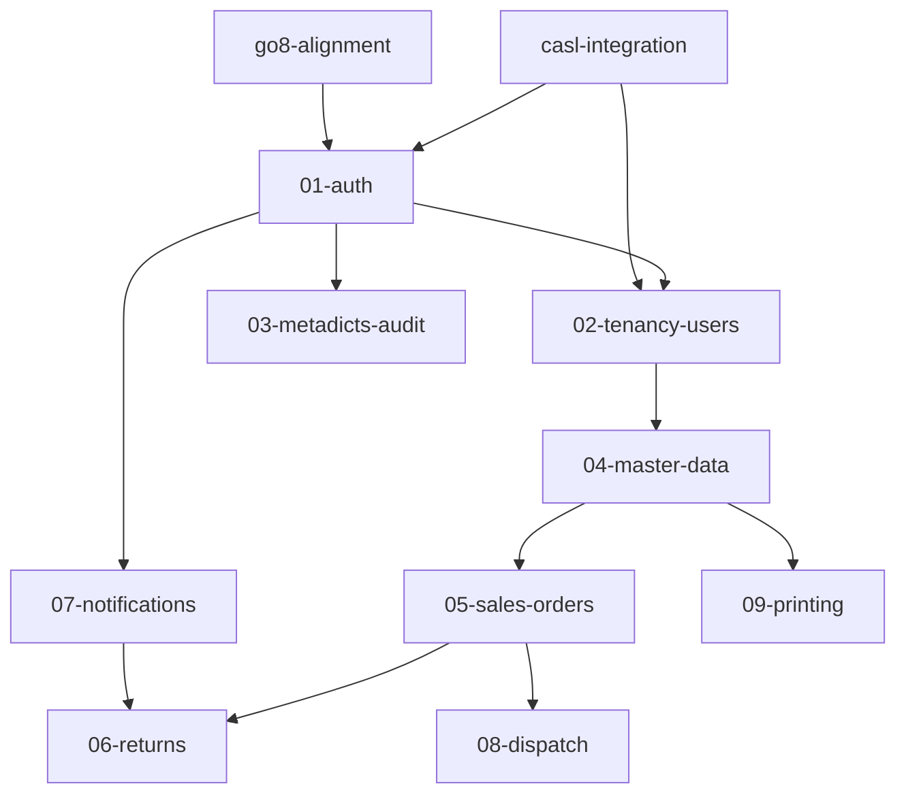

# 計畫目錄統合整理 Implementation Plan

> **For agentic workers:** REQUIRED SUB-SKILL: Use superpowers:subagent-driven-development (recommended) or superpowers:executing-plans to implement this plan task-by-task. Steps use checkbox (`- [ ]`) syntax for tracking.

**Goal:** 將 `docs/superpowers/plans/` 重新分類（backend/、app/、cross-cutting/、reference/、archive/），建立總索引 README.md，並修復所有斷鏈。

**Architecture:** 全部 `git mv` 搬移保留歷史；連結修復分兩類——`backend-detail/` 路徑更新、舊根層計畫路徑更新；逐檔 edit，不用全域 sed；最後 grep 驗證 0 殘留。

**Tech Stack:** git、grep、Markdown

**Spec:** `docs/superpowers/specs/2026-08-31-plans-consolidation-design.md`

## Global Constraints

- 所有搬移用 `git mv`，保留 git 歷史
- 不重新命名任何檔案，只搬移
- 不修改任何計畫的實質內容（Task 步驟、依賴描述、版本號）；僅改路徑字串
- 本計畫檔本身（`2026-08-31-plans-consolidation-plan.md`）留在 plans/ 根層，不搬移
- `.solomd/`、`.DS_Store` 不動
- 路徑替換對照（全文適用）：
  - `docs/superpowers/plans/backend-detail/` → `docs/superpowers/plans/backend/detail/`
  - 搬入 `backend/` 的檔案內，相對寫法 `backend-detail/` → `detail/`
  - `docs/superpowers/plans/2026-07-17-sales-order-1-0-tasks.md` → `docs/superpowers/plans/reference/2026-07-17-sales-order-1-0-tasks.md`
  - `docs/superpowers/plans/2026-08-03-…vibecheck-plan.md` → `docs/superpowers/plans/archive/…`
  - `docs/superpowers/plans/2026-08-04-app-flutter-stack.md` → `docs/superpowers/plans/app/…`
  - `docs/superpowers/plans/2026-08-17-backend-…` → `docs/superpowers/plans/backend/…`
  - `docs/superpowers/plans/2026-08-24-backend-go8-alignment-plan.md` → `docs/superpowers/plans/backend/…`
  - `docs/superpowers/plans/2026-08-24-casl-integration-plan.md` → `docs/superpowers/plans/cross-cutting/…`
  - 主計畫 `2026-08-05-…subproject-implementation-plan.md` 留在根層，路徑不變

---

## File Structure

```
docs/superpowers/plans/
├── README.md                        ← Task 4 新建
├── 2026-08-05-…-subproject-implementation-plan.md   ← 不動
├── 2026-08-31-plans-consolidation-plan.md           ← 本計畫，不動
├── reference/2026-07-17-sales-order-1-0-tasks.md    ← Task 2
├── backend/2026-08-17-backend-0{1..9}-*-plan.md     ← Task 1
├── backend/2026-08-24-backend-go8-alignment-plan.md ← Task 2
├── backend/detail/00-index.md ~ 09-printing.md      ← Task 1
├── app/2026-08-04-app-flutter-stack.md              ← Task 2
├── cross-cutting/2026-08-24-casl-integration-plan.md← Task 2
└── archive/2026-08-03-sales-order-1.0-vibecheck-plan.md ← Task 2
```

---

### Task 1: 搬移後端計畫與細部目錄

**Files:**
- Move: `docs/superpowers/plans/2026-08-17-backend-0{1..9}-*-plan.md` → `docs/superpowers/plans/backend/`
- Move: `docs/superpowers/plans/backend-detail/` → `docs/superpowers/plans/backend/detail/`

**Interfaces:**
- Consumes: none
- Produces: `backend/`、`backend/detail/` 目錄存在

- [ ] **Step 1: 建立目錄並搬移 9 份後端計畫**

```bash
cd /Volumes/UTM2/Developer/sales-order-dispatch
mkdir -p docs/superpowers/plans/backend
cd docs/superpowers/plans
git mv 2026-08-17-backend-01-auth-plan.md 2026-08-17-backend-02-tenancy-users-plan.md 2026-08-17-backend-03-metadicts-audit-plan.md 2026-08-17-backend-04-master-data-plan.md 2026-08-17-backend-05-sales-orders-plan.md 2026-08-17-backend-06-returns-plan.md 2026-08-17-backend-07-notifications-plan.md 2026-08-17-backend-08-dispatch-plan.md 2026-08-17-backend-09-printing-plan.md backend/
```

- [ ] **Step 2: 搬移細部目錄**

```bash
cd /Volumes/UTM2/Developer/sales-order-dispatch/docs/superpowers/plans
git mv backend-detail backend/detail
```

- [ ] **Step 3: 驗收**

Run: `ls docs/superpowers/plans/backend/ && ls docs/superpowers/plans/backend/detail/`
Expected: 9 份 plan + `detail/`；detail/ 內 00-index.md 到 09-printing.md 共 10 檔
Run: `git status --short | head -25`
Expected: 全部顯示 `R`（rename），無 `D`+`A` 組合

- [ ] **Step 4: Commit**

```bash
git add -A docs/superpowers/plans
git commit -m "docs: 後端計畫與細部文件搬入 backend/"
```

---

### Task 2: 搬移其餘計畫

**Files:**
- Move: `2026-08-24-backend-go8-alignment-plan.md` → `backend/`
- Move: `2026-08-04-app-flutter-stack.md` → `app/`
- Move: `2026-08-24-casl-integration-plan.md` → `cross-cutting/`
- Move: `2026-07-17-sales-order-1-0-tasks.md` → `reference/`
- Move: `2026-08-03-sales-order-1.0-vibecheck-plan.md` → `archive/`

**Interfaces:**
- Consumes: Task 1 的 `backend/`
- Produces: 完整目標目錄結構

- [ ] **Step 1: 建立目錄並搬移**

```bash
cd /Volumes/UTM2/Developer/sales-order-dispatch/docs/superpowers/plans
mkdir -p app cross-cutting reference archive
git mv 2026-08-24-backend-go8-alignment-plan.md backend/
git mv 2026-08-04-app-flutter-stack.md app/
git mv 2026-08-24-casl-integration-plan.md cross-cutting/
git mv 2026-07-17-sales-order-1-0-tasks.md reference/
git mv 2026-08-03-sales-order-1.0-vibecheck-plan.md archive/
```

- [ ] **Step 2: 驗收**

Run: `ls docs/superpowers/plans/`
Expected: `README` 尚不存在；目錄含 `app archive backend cross-cutting reference` + 根層 3 份 md（主計畫、本計畫）+ `.solomd` `.DS_Store`
Run: `git status --short | grep -c "^R"`
Expected: 5（本 task 的 rename 數）

- [ ] **Step 3: Commit**

```bash
git add -A docs/superpowers/plans
git commit -m "docs: go8/flutter/casl/tasks/vibecheck 歸入子目錄"
```

---

### Task 3: 修復 `backend-detail` 路徑引用

**Files:**
- Modify: `docs/superpowers/plans/backend/2026-08-17-backend-01-auth-plan.md`（4 處：L7、L11、L24、L4067）
- Modify: `docs/superpowers/plans/backend/2026-08-17-backend-02-tenancy-users-plan.md`（3 處：L7、L11、L4929）
- Modify: `docs/superpowers/plans/backend/2026-08-17-backend-03-metadicts-audit-plan.md`（3 處：L7、L11、L1665）
- Modify: `docs/superpowers/plans/backend/2026-08-17-backend-04-master-data-plan.md`（3 處：L7、L11、L1828）
- Modify: `docs/superpowers/plans/backend/2026-08-17-backend-05-sales-orders-plan.md`（3 處：L7、L11、L1549）
- Modify: `docs/superpowers/plans/backend/2026-08-17-backend-06-returns-plan.md`（3 處：L7、L11、L1321）
- Modify: `docs/superpowers/plans/backend/2026-08-17-backend-07-notifications-plan.md`（6 處：L7、L11、L1437、L1966、L2782、L3581）
- Modify: `docs/superpowers/plans/backend/2026-08-17-backend-08-dispatch-plan.md`（3 處：L7、L11、L2687）
- Modify: `docs/superpowers/plans/backend/2026-08-17-backend-09-printing-plan.md`（3 處：L7、L11、L4170）
- Modify: `docs/superpowers/plans/backend/2026-08-24-backend-go8-alignment-plan.md`（10 處：L43、L44、L53、L86、L149、L155、L161、L164、L178、L184）
- Modify: `docs/superpowers/plans/cross-cutting/2026-08-24-casl-integration-plan.md`（4 處：L52、L53、L113、L127）
- Modify: `docs/superpowers/specs/2026-08-24-backend-go8-structure-design.md`（3 處：L90、L91、L92）
- Modify: `docs/superpowers/specs/2026-08-24-casl-integration-design.md`（2 處：L190、L191）

**Interfaces:**
- Consumes: Task 1–2 的新目錄結構
- Produces: `backend-detail` 字串在全 repo 僅剩零處

行號為搬移前掃描值，搬移不影響行號；執行時以字串比對為準，行號僅供定位。

- [ ] **Step 1: 修 9 份後端計畫**

每份檔案的替換規則：
- `docs/superpowers/plans/backend-detail/` → `docs/superpowers/plans/backend/detail/`
- 殘留的相對寫法 `backend-detail/`（L24、L4067、L4929、L1665、L1828、L1549、L1321、L1437、L1966、L2782、L3581、L2687、L4170 等）→ `detail/`

注意：
- 07 計畫 L1966 在 Go 註解內（`// TODO(相依: backend-detail/04-master-data.md …`），同樣替換
- 07 計畫 L2782 一行有兩處 `backend-detail/`，都換
- 03/04/05 計畫 L11 的「共通規則見 `00-index.md` §3」不含 backend-detail 字串，不動；只有含 `backend-detail` 的部分才換

- [ ] **Step 2: 修 go8-alignment（backend/）**

- L43、L44、L86、L149、L155、L164、L178、L184：`docs/superpowers/plans/backend-detail/` → `docs/superpowers/plans/backend/detail/`
- L53：`` `backend-detail/02–09` `` → `` `backend/detail/02–09` ``（此為表格簡寫，保留目錄前綴語意）
- L161：`### Task 3: backend-detail/01-auth.md 錨點修訂` → `### Task 3: backend/detail/01-auth.md 錨點修訂`

- [ ] **Step 3: 修 casl-integration（cross-cutting/）**

- L52、L53：`docs/superpowers/plans/backend-detail/` → `docs/superpowers/plans/backend/detail/`
- L113：`backend-detail/01-auth.md` → `backend/detail/01-auth.md`
- L127：`backend-detail/02-tenancy-users.md` → `backend/detail/02-tenancy-users.md`

- [ ] **Step 4: 修兩份 specs**

`specs/2026-08-24-backend-go8-structure-design.md`：
- L90、L91：`backend-detail/0X…` → `plans/backend/detail/0X…`（表格簡寫，補上 plans/ 前綴使其成為 specs 相對可用的路徑）
- L92：`` `backend-detail/02–09` `` → `` `plans/backend/detail/02–09` ``

`specs/2026-08-24-casl-integration-design.md`：
- L190：`backend-detail/01-auth.md` → `plans/backend/detail/01-auth.md`
- L191：`backend-detail/02-tenancy-users.md` → `plans/backend/detail/02-tenancy-users.md`

- [ ] **Step 5: 驗收**

Run: `grep -rn "backend-detail" --include="*.md" /Volumes/UTM2/Developer/sales-order-dispatch/docs`
Expected: 僅 `docs/superpowers/specs/2026-08-31-plans-consolidation-design.md`（本設計文件，記錄舊路徑屬正常）與 `docs/superpowers/plans/2026-08-31-plans-consolidation-plan.md`（本計畫）；其餘 0 hits

- [ ] **Step 6: Commit**

```bash
git add -A docs
git commit -m "docs: backend-detail 路徑更新為 backend/detail"
```

---

### Task 4: 修復舊根層計畫路徑引用

**Files:**
- Modify: `docs/PLANNING_OVERVIEW.md`（L20、L21、L147）
- Modify: `docs/superpowers/plans/backend/detail/00-index.md`（L4）
- Modify: `docs/superpowers/plans/backend/detail/03-metadicts-audit.md`（L4）
- Modify: `docs/superpowers/plans/backend/detail/05-sales-orders.md`（L5）
- Modify: `docs/superpowers/plans/backend/detail/09-printing.md`（L3）
- Modify: `docs/superpowers/plans/backend/2026-08-17-backend-0{1,2,3,4,5,6,7,8,9}-*-plan.md`（各 1 處自我引用「Plan complete and saved to」）
- Modify: `docs/superpowers/plans/backend/2026-08-24-backend-go8-alignment-plan.md`（L45–L50、L193、L225、L231、L240、L277、L283、L292、L324、L330、L341–L346、L380、L386、L395、L405、L411）
- Modify: `docs/superpowers/plans/cross-cutting/2026-08-24-casl-integration-plan.md`（L54）
- Modify: `docs/superpowers/plans/app/2026-08-04-app-flutter-stack.md`（L1531）
- Modify: `docs/superpowers/specs/2026-08-05-sales-order-1.0-subproject-decomposition-design.md`（L9；L576 為裸檔名不動）
- Modify: `docs/superpowers/reports/archive/2026-07-17-status-alignment.md`（L13；L141、L153 為裸檔名不動）

**Interfaces:**
- Consumes: Task 1–3 完成的新結構
- Produces: 全 repo 無指向舊根層計畫路徑的引用

替換對照見 Global Constraints。裸檔名（無路徑前綴）引用不動——檔名未改。

- [ ] **Step 1: 修 PLANNING_OVERVIEW.md**

- L20：`docs/superpowers/plans/2026-07-17-sales-order-1-0-tasks.md` → `docs/superpowers/plans/reference/2026-07-17-sales-order-1-0-tasks.md`
- L21：`docs/superpowers/plans/2026-08-03-sales-order-1.0-vibecheck-plan.md` → `docs/superpowers/plans/archive/2026-08-03-sales-order-1.0-vibecheck-plan.md`
- L147：同 L20 替換

- [ ] **Step 2: 修 backend/detail/ 4 檔對原計畫的引用**

- `00-index.md` L4、`03-metadicts-audit.md` L4、`05-sales-orders.md` L5、`09-printing.md` L3：`docs/superpowers/plans/2026-07-17-sales-order-1-0-tasks.md` → `docs/superpowers/plans/reference/2026-07-17-sales-order-1-0-tasks.md`
- 注意 `09-printing.md` L3 的路徑在 YAML frontmatter `source_tasks` 行內且無反引號包裹，替換字串相同

- [ ] **Step 3: 修 9 份後端計畫的自我引用**

每份計畫末尾約 L4057–L4170 有一行 `Plan complete and saved to \`docs/superpowers/plans/2026-08-17-backend-0X-…\``，將 `docs/superpowers/plans/2026-08-17-backend-` → `docs/superpowers/plans/backend/2026-08-17-backend-`。

- [ ] **Step 4: 修 go8-alignment**

- L45：`docs/superpowers/plans/2026-07-17-…tasks.md` → `…/reference/…`
- L46：`docs/superpowers/plans/2026-08-05-…` → 不動（主計畫留根層）
- L47、L48、L49：`docs/superpowers/plans/2026-08-17-backend-` → `docs/superpowers/plans/backend/2026-08-17-backend-`（L48/L49 為 brace glob 字串，同樣處理）
- L50、L395、L405、L411：`docs/superpowers/plans/2026-08-24-casl-integration-plan.md` → `docs/superpowers/plans/cross-cutting/2026-08-24-casl-integration-plan.md`
- L193、L225、L231：tasks 路徑 → reference/
- L240、L277、L283：主計畫路徑 → 不動
- L292、L324、L330、L341–L346、L380、L386：`2026-08-17-backend-` 路徑 → backend/ 下

- [ ] **Step 5: 修 casl-integration**

- L54：`docs/superpowers/plans/2026-08-05-sales-order-1.0-subproject-implementation-plan.md` → 不動（主計畫留根層）。**本檔此 task 無需修改**，跳過。

- [ ] **Step 6: 修 app-flutter-stack**

- L1531：`docs/superpowers/plans/2026-07-17-sales-order-1-0-tasks.md` → `docs/superpowers/plans/reference/2026-07-17-sales-order-1-0-tasks.md`

- [ ] **Step 7: 修 specs 與 reports**

- `specs/2026-08-05-…-decomposition-design.md` L9：tasks 路徑 → reference/
- `reports/archive/2026-07-17-status-alignment.md` L13：tasks 路徑 → reference/

- [ ] **Step 8: 驗收**

Run: `grep -rn "docs/superpowers/plans/2026-08-17-backend\|docs/superpowers/plans/2026-08-24-backend\|docs/superpowers/plans/2026-08-24-casl\|docs/superpowers/plans/2026-08-04-app\|docs/superpowers/plans/2026-08-03\|docs/superpowers/plans/2026-07-17" --include="*.md" /Volumes/UTM2/Developer/sales-order-dispatch`
Expected: 僅本計畫與本設計文件自身；其餘 0 hits

- [ ] **Step 9: Commit**

```bash
git add -A docs
git commit -m "docs: 舊根層計畫路徑更新至新目錄"
```

---

### Task 5: 建立總索引 README.md

**Files:**
- Create: `docs/superpowers/plans/README.md`

**Interfaces:**
- Consumes: Task 1–4 的最終目錄結構與 checkbox 統計
- Produces: 總索引主計畫

- [ ] **Step 1: 重新掃描 checkbox（以執行當下為準）**

```bash
cd /Volumes/UTM2/Developer/sales-order-dispatch/docs/superpowers/plans
for f in 2026-08-05-*.md backend/2026-*.md app/*.md cross-cutting/*.md reference/*.md; do
  total=$(grep -c '^- \[[ x]\]' "$f" || true)
  done_n=$(grep -c '^- \[x\]' "$f" || true)
  echo "$f: $done_n/$total"
done
```

以輸出數字填入下表；若與本文數字不同，以掃描值為準。

- [ ] **Step 2: 寫入 README.md**

完整內容（數字為 2026-08-31 掃描值，Step 1 若有出入以掃描值為準）：

````markdown
# 多公司訂出貨系統 1.0 — 計畫總索引

> 狀態與進度由 checkbox 掃描產生；最後掃描：2026-08-31

## 目錄導覽

- `2026-08-05-sales-order-1.0-subproject-implementation-plan.md`（根層）：主計畫。50 Tasks 分 5 Waves，涵蓋 Backend / Web / App 三子專案
- `backend/`：後端分域實作計畫（01~09）+ go8 架構對齊計畫
- `backend/detail/`：後端細部功能文件。`00-index.md` 為共通規則；01~09 對應各分域
- `app/`：App 技術棧選型計畫
- `cross-cutting/`：橫切前後端的整合計畫
- `reference/`：原計畫（v2.9.0）。各計畫以「原計畫 Task x.y」引用
- `archive/`：歷史文件
- 尚無前端專屬計畫；Web 端工作目前散見於主計畫與 cross-cutting

## 執行順序與依賴

**前置修正**（修改計畫文件本身，須先於對應實作落地）：

1. `backend/2026-08-24-backend-go8-alignment-plan.md` — D31 架構慣例（config 分檔、`InitDomains()`、cmd 拆分）落地到各計畫文件
2. `cross-cutting/2026-08-24-casl-integration-plan.md` — CASL 規則格式（conditions/inverted/sort_order）落地到 01/02 細部文件與前端 ability 結構

**後端實作順序**：



依據：02~09 沿用 01 的地基（testutil、middleware.Authenticate、audit.Recorder）；04 重用 01 的 issueTempPassword 與 02 的 Logo；05 對齊 04 契約；06 讀取 05 的 sales_orders 實體並採 07 的通知契約；08 與 05 同套件共用訂單狀態機；09 的 FileStore 由 04 Task 8 提供。

## 計畫一覽

| 計畫 | 路徑 | 範圍 | 進度 | 狀態 | 依賴 |
|------|------|------|------|------|------|
| 主計畫 | `2026-08-05-…-subproject-implementation-plan.md` | 三子專案 50 Tasks / 5 Waves | 5/298 | 進行中 | — |
| go8-alignment | `backend/2026-08-24-backend-go8-alignment-plan.md` | 後端結構對齊（D31） | 0/38 | 未開始 | 無；須先於 01 實作 |
| casl-integration | `cross-cutting/2026-08-24-casl-integration-plan.md` | CASL 前後端整合 | 0/71 | 未開始 | 無；須先於 01/02 實作 |
| 01-auth | `backend/2026-08-17-backend-01-auth-plan.md` | 認證授權地基 | 0/75 | 未開始 | go8、casl |
| 02-tenancy-users | `backend/2026-08-17-backend-02-tenancy-users-plan.md` | 多租戶與使用者 | 0/38 | 未開始 | 01、casl |
| 03-metadicts-audit | `backend/2026-08-17-backend-03-metadicts-audit-plan.md` | 字典檔與稽核 | 0/28 | 未開始 | 01 |
| 04-master-data | `backend/2026-08-17-backend-04-master-data-plan.md` | 主檔與檔案資產 | 0/44 | 未開始 | 01、02 |
| 05-sales-orders | `backend/2026-08-17-backend-05-sales-orders-plan.md` | 銷售訂單 | 0/23 | 未開始 | 04 |
| 06-returns | `backend/2026-08-17-backend-06-returns-plan.md` | 退貨 | 0/18 | 未開始 | 01、04、05、07 |
| 07-notifications | `backend/2026-08-17-backend-07-notifications-plan.md` | 通知與 FCM | 0/40 | 未開始 | 01 |
| 08-dispatch | `backend/2026-08-17-backend-08-dispatch-plan.md` | 派工看板 | 0/26 | 未開始 | 05 |
| 09-printing | `backend/2026-08-17-backend-09-printing-plan.md` | 列印與 PDF | 0/34 | 未開始 | 04 |
| app-flutter-stack | `app/2026-08-04-app-flutter-stack.md` | App 技術棧（D29） | 0/51 | 未開始 | 主計畫 Task 5 |
| 原計畫 | `reference/2026-07-17-sales-order-1-0-tasks.md` | v2.9.0 執行計畫 | 0/407 | 未開始 | — |
| vibecheck | `archive/2026-08-03-sales-order-1.0-vibecheck-plan.md` | 歷史驗證計畫 | — | 歸檔 | — |

## 狀態定義

- 未開始：0% checkbox 完成
- 進行中：>0% 且 <100%
- 完成：100%
- 歸檔：歷史文件，不再追蹤進度

## 維護方式

- 新增計畫時歸入對應子目錄並更新本表
- 進度數字以 checkbox 掃描為準，執行計畫時定期更新「最後掃描」日期與本表
````

- [ ] **Step 3: 驗收——連結存在性**

對 README.md 表格中路徑欄的每個值，逐一確認檔案存在：

```bash
cd /Volumes/UTM2/Developer/sales-order-dispatch/docs/superpowers/plans
for p in \
  "2026-08-05-sales-order-1.0-subproject-implementation-plan.md" \
  "backend/2026-08-24-backend-go8-alignment-plan.md" \
  "cross-cutting/2026-08-24-casl-integration-plan.md" \
  "backend/2026-08-17-backend-01-auth-plan.md" \
  "backend/2026-08-17-backend-02-tenancy-users-plan.md" \
  "backend/2026-08-17-backend-03-metadicts-audit-plan.md" \
  "backend/2026-08-17-backend-04-master-data-plan.md" \
  "backend/2026-08-17-backend-05-sales-orders-plan.md" \
  "backend/2026-08-17-backend-06-returns-plan.md" \
  "backend/2026-08-17-backend-07-notifications-plan.md" \
  "backend/2026-08-17-backend-08-dispatch-plan.md" \
  "backend/2026-08-17-backend-09-printing-plan.md" \
  "app/2026-08-04-app-flutter-stack.md" \
  "reference/2026-07-17-sales-order-1-0-tasks.md" \
  "archive/2026-08-03-sales-order-1.0-vibecheck-plan.md"; do
  [ -f "$p" ] && echo "OK $p" || echo "MISSING $p"
done
```

Expected: 全部 `OK`，無 `MISSING`

- [ ] **Step 4: Commit**

```bash
git add docs/superpowers/plans/README.md
git commit -m "docs: plans 總索引 README"
```

---

### Task 6: 全量驗證

**Files:**
- 無新增修改；僅驗證

**Interfaces:**
- Consumes: Task 1–5 全部完成
- Produces: 驗證通過記錄

- [ ] **Step 1: 舊路徑零殘留**

Run: `grep -rn "backend-detail" --include="*.md" /Volumes/UTM2/Developer/sales-order-dispatch/docs | grep -v "plans-consolidation"`
Expected: 0 hits

Run: `grep -rn "docs/superpowers/plans/2026-08-17-backend\|docs/superpowers/plans/2026-08-24-backend\|docs/superpowers/plans/2026-08-24-casl\|docs/superpowers/plans/2026-08-04-app\|docs/superpowers/plans/2026-08-03\|docs/superpowers/plans/2026-07-17" --include="*.md" /Volumes/UTM2/Developer/sales-order-dispatch | grep -v "plans-consolidation"`
Expected: 0 hits

- [ ] **Step 2: 非 md 檔掃描**

Run: `grep -rln "backend-detail" /Volumes/UTM2/Developer/sales-order-dispatch --exclude-dir=.git --exclude-dir=node_modules 2>/dev/null | grep -v "\.md$"`
Expected: 僅可能出現 `.solomd/session-*.json`（會話記錄，不修改）；其他 0 hits。若出現其他檔案，評估後修復或記錄原因

- [ ] **Step 3: git 歷史保留確認**

Run: `git log --follow --oneline -3 -- docs/superpowers/plans/backend/2026-08-17-backend-01-auth-plan.md`
Expected: 顯示搬移前的歷史 commit（follow 成功）

- [ ] **Step 4: 最終目錄結構確認**

Run: `find docs/superpowers/plans -name "*.md" | sort`
Expected: 17 份 md——根層 3（主計畫、本計畫、README）、backend 10、backend/detail 10、app 1、cross-cutting 1、reference 1、archive 1（總計 27 扣除重複計算的 backend/detail 內 10 份後為 17+10=27；以實際樹狀核對，重點是無檔案遺失、無檔案留在錯誤位置）

- [ ] **Step 5: Commit（如有修正）**

若 Step 1–2 發現殘留並修復：

```bash
git add -A docs
git commit -m "docs: 計畫路徑殘留修正"
```

無修正則無需 commit。

---

## Self-Review 記錄

- Spec 覆蓋：§目錄結構 → Task 1–2；§斷鏈修復 → Task 3–4；§README → Task 5；§驗證 → Task 6 與各 Task 驗收步驟
- 佔位符掃描：無 TBD/TODO；README 完整內容已含於 Task 5 Step 2
- 一致性：替換對照在 Global Constraints 統一定義，各 Task 引用之；行號標註「以字串比對為準」避免搬移後行號漂移問題
