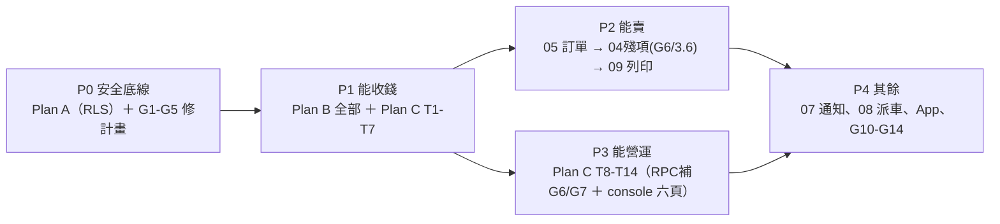

# 專案缺口盤點與實作優先序（2026-09-20）

> **性質**：跨計畫的整體複查（1.0 產品域 ＋ SaaS 三份計畫 ＋ spec）與實作排序。缺口分為**已查證的缺陷**（有檔案行號證據）、**待決策**、**後續項**三類；排序依「安全底線 → 能收錢 → 能賣 → 能營運」。
> **關係**：本文件是排序與缺口的權威；各計畫的實作內容仍以計畫本身為準（缺口修法以「指向哪一份計畫的哪個任務」表達）。
> **相關**：spec `2026-09-20-saas-billing-entitlements-design.md`、計畫 ①`-rls-tenant-isolation`／②`-platform-entitlements`／③`-platform-lifecycle-console`。

---

## 1. 已查證的缺陷（必須修，否則會做出錯的帳或開不了機）

| # | 缺陷 | 證據 | 影響 | 修法 |
|---|---|---|---|---|
| G1 | **訂閱沒有計費週期**，期別產生卻硬編「一個月」（`PeriodEnd.AddDate(0, 1, 0)`） | `-platform-lifecycle-console-plan.md:1666`；`platform.subscriptions` 欄位清單（`-platform-entitlements-plan.md:319` 附近）無 `billing_cycle` | **年繳方案每次只產生一個月期別 → 直接少收 11 個月的錢** | ② 的 migration 00029 加 `subscriptions.billing_cycle text NOT NULL DEFAULT 'monthly'`（並於 `plan_prices` 對應）；③ 的 `EnsureNextPeriod` 依 `billing_cycle` 決定 `AddDate(0,1,0)` 或 `AddDate(1,0,0)`；補一條年繳測試 |
| G2 | **日期算術未處理月底**（Go 的 `AddDate` 會正規化） | 同上 `:1666` | 1/31 到期 → 下一期起日 3/3（跳過整個 2 月），帳期與服務期不一致 | 新增 `addBillingPeriod(from, cycle)` 純函式：取「下月同日，不存在則當月最後一日」（1/31→2/28）；單元測試釘住 1/31、3/31、閏年 |
| G3 | **空交易號的重送會重複入帳事件**：no-op 條件要求 `in.ExternalRef != ""` | `-platform-lifecycle-console-plan.md:1169` | 人工收款（多數沒有交易號）重送 → 再寫一次 `period.payment_recorded`，事件流與稽核失真 | no-op 條件改為「期別已 `paid` **且**（`external_ref` 相同 **或** 兩者皆空）→ 直接回既有期別」；補「兩次空交易號呼叫只寫一次事件」測試 |
| G4 | **輸入金額從未與期別快照比對** | `RecordPaymentInput.AmountCents` 只出現在事件與稽核 payload（`:1196`、`:1203`），實作無任何比對 | 營運輸入 3000 而期別是 1950 → 帳面顯示 1950、事件寫 1950，**輸入被默默丟棄** | 明確規則：`AmountCents == 0` → 採快照；`!= 0 && != 快照` → `FailedPrecondition`（部分付款屬未支援，見 G10）；補兩條測試 |
| G5 | **系統 actor 沒有 seed**：`platform.settings.system_actor_user_id` 只在測試 fixture 出現 | `-platform-lifecycle-console-plan.md:605`（測試 INSERT）、`:2217`（cron 讀取即 Fatal） | `cmd/platform-cron` **一開跑就 Fatal**；consumer 的凍結也會因缺 actor 而失敗 | ② 的 `SeedPlatform` 追加：建立平台自營公司（`companies.identifier='platform'`）＋系統使用者 ＋ 寫入 `platform.settings`（冪等）；③ 的 cron 改為「缺設定即明確報錯並附修復指令」 |

## 2. 待決策（會影響計畫內容，需你定調）

| # | 議題 | 現況 | 建議 |
|---|---|---|---|
| G6 | **方案變更、席位變更、取消**三個寫入 RPC 缺席 | ③ 的寫入 RPC 清單（Task 9）只有 override／收款／方案價目／operator；spec §5.2 卻要求「營運後台終止」、§2.4 要求席位可調 | 補 `SetSeatCount`、`ChangePlan`（v1 只做「下一期生效」，不做按日比例）、`CancelSubscription`（期末終止）三支；spec §5.6 同步寫明「cancelled 到期後由排程轉 suspended」 |
| G7 | **已取消訂閱到期後無人處理**：`MarkPastDue` 只掃 `active` | spec §5.6 只寫「期別照算到 period_end」 | 排程加一步：`cancelled` 且 `period_end < now` → 公司轉 `suspended`（不再發訂閱事件，改發 `subscription.expired`），並補測試 |
| G8 | **部分付款／溢收短收無處記錄** | `RecordPayment` 只支援「整期 paid」或「no-op」 | v1 明示不支援部分付款；但 `subscription_periods` 加 `note text`（營運註記短收/溢收與處理方式），否則對帳差異無處可放 |
| G9 | **租戶端無處提供開票資訊** | ③ 的 `RecordPaymentRequest` 有 `buyer_tax_id`／`carrier`，但那是**平台端**欄位（營運要打電話問客戶） | 加一頁「帳務資訊」（租戶後台或 App）：統編、發票地址、載具、聯絡人；平台開票時直接取用。v1 可先做租戶後台欄位 |
| G10 | **平台稽核保留期未定** | D27 的「1/3/6/12 月或永久」是為**業務**稽核設計 | 帳務與平台稽核法遵上通常要 5–7 年：明定 `platform.audit_logs` 與 `subscription_periods` 不套用 D27 的清理（或另立保留期），並寫進 spec |
| G11 | **資料匯出（合約終止後客戶帶走資料）** | 目前只說「不刪除」 | 列 1.1：匯出成 CSV/JSON 套件；v1 以人工 SQL 匯出並記錄在案（不要無聲跳過） |
| G12 | **App 完全沒被 SaaS 化影響到** | 三份計畫皆寫「app 不在範圍」 | App 至少要有：`FailedPrecondition`（方案未含/超額）的友善呈現、QR 兌換（04 3.8）、「我的方案」唯讀頁。列 P4，但**錯誤碼呈現**應早於 App 業務頁 |

## 3. 後續項（不阻塞，但要有人記著）

| # | 項目 | 說明 |
|---|---|---|
| G13 | D21 的 70% 覆蓋率 CI 門檻仍未落地 | 三份計畫新增大量測試，正好是設定門檻的時機（建議：go 以 `-coverprofile`、前端 vitest coverage，門檻先設 60% 再往上） |
| G14 | CI 時間 | `go-integration` 將新增大量 testcontainers 測試；建議拆 job（platform／rls／domain）或加 `-run` 分組，避免單 job 超過 20 分鐘 |
| G15 | 平台側沒有第二道防線 | `platform` 表不套 RLS（設計如此），console 的 operator 授權**全靠服務層檢查**；緩解是 `app_rw` 零權限。建議在 AGENTS.md 明寫「平台 RPC 的授權只有一層，任何新增路徑都必須有服務層檢查與測試」 |
| G16 | Plan A 與 Plan B 改到同一批檔案 | 兩者都要改 `user/customer/product/company_service.go` 及其測試 → **不可並行**，須 A 完成（含其測試更新）再開 B，否則衝突成本高於節省的時間 |

---

## 4. 實作優先序

### P0：安全底線與計畫修正（不可跳、且先於一切）

| 序 | 工作 | 為什麼在這個位置 |
|---|---|---|
| P0-1 | **Plan A 全 10 個任務**（RLS 租戶隔離啟用） | 目前跨租戶隔離只靠服務層；SaaS 是合約承諾，這條是唯一無法事後補的（資料外洩不可回復）。且它牽動所有服務檔，越晚做衝突越大 |
| P0-2 | **修 G1–G5**（③ 的 billing_cycle／日期算術／空交易號冪等／金額驗證；② 的系統 actor seed） | 五個都是「不修就會做出錯的帳或開不了機」，且都在 P1 的檔案內；先修計畫再開工，比開工後回頭改便宜 |
| P0-3 | **定調 G6／G7**（三個寫入 RPC 與 cancelled 到期行為）並同步 spec | 這兩個會改變 P1 的 RPC 介面；介面定了才好寫測試 |
| P0-4 | **在 AGENTS.md 寫入 G15**（平台授權只有一層） | 一行慣例，避免 P1 的新路徑漏檢查 |

**驗收**：`task test:integration` 全綠；以 `app_rw` 直連看不到他租戶資料；跨租戶寫入被擋（Plan A 的紅→綠測試）。

### P1：能收錢的最小閉環

| 序 | 工作 | 依賴／理由 |
|---|---|---|
| P1-1 | **Plan B T1–T6**（platform schema、store、entitlement、計數器、守衛） | 權益判定是所有寫入路徑的守衛介面，先定 |
| P1-2 | **Plan B T7–T12**（platform/v1、operator 認證、唯讀 RPC、投影、seeds） | 與 P1-1 同計畫；seeds 必須含 G5 的系統 actor |
| P1-3 | **Plan C T1–T7**（狀態入口、money、帳務 store、`RecordPayment`、生命週期、consumer、cron） | 依賴 P1-1／P1-2 的 store 與 seeds |
| P1-4 | **Plan C 的 G6／G7 三支 RPC ＋ cancelled 到期排程** | 收費能力的一部分（沒有「取消」就無法處理解約） |

**交付判準（可執行的場景）**：以 CLI/seed 開通一家租戶 → `RecordPayment` 記一筆匯款 → 到期未付自動 `past_due` → 寬限後自動 `suspended`（登入被擋、資料保留）→ 補款自動復原；每一步都有 `platform.audit_logs` 與 `events`。
**注意**：此時尚無 console UI，靠 `task platform:cron` ＋ 直接呼叫 RPC（可接受：v1 租戶數少）。

### P2：產品可賣性（可與 P3 並行）

| 序 | 工作 | 理由 |
|---|---|---|
| P2-1 | **04 殘項 3.6 檔案資產（FileStore）** | 09 列印的硬依賴；也是 `limit.storage_gb` 的守衛掛點來源 |
| P2-2 | **05 銷售訂單**（含 Plan B 的守衛接點：`feature.printing` 等） | 產品的核心價值；沒有訂單，SaaS 等於賣空殼 |
| P2-3 | **09 單據列印**（四種 PDF、Gotenberg） | 陳老闆需求的主賣點；依賴 P2-1 |
| P2-4 | **04 3.5 客戶專屬商品、3.8 QR 兌換** | 訂單與 App 登入的前置 |

**可並行**：P2 與 P3 無檔案重疊（P2 為業務域，P3 為平台域＋console）。

### P3：能營運（UI 與快取）

| 序 | 工作 | 理由 |
|---|---|---|
| P3-1 | **Plan C T8**（Valkey 快取＋失效） | 多 replica 的正確性；單 replica 時 MemoryCache 已夠，故非最急 |
| P3-2 | **Plan C T9**（平台寫入 RPC ＋ 稽核） | console 的前置 |
| P3-3 | **Plan C T10–T12**（console 骨架與六頁） | 租戶數 > 5 時人工 CLI 會成為瓶頸；在此之前可延 |
| P3-4 | **Plan C T13–T14**（租戶端權益卡片、CI／慣例） | 卡片讓客戶自助看到用量，減少客服；CI 併入 G14 的拆分 |

### P4：其餘產品域與長期項

08 派車看板 → 10 fleet（D32）→ 07 通知（催收提醒與下單推播的依賴，G6/G7 之後才會有自動提醒需求）→ App 業務頁與 G12 的錯誤呈現 → G10（稽核保留期）／G11（資料匯出）／G13（覆蓋率門檻）。

---

## 5. 一頁掌握：接下來三步

1. **修 G1–G5 與定調 G6／G7**（改 ② 與 ③ 兩份計畫 ＋ spec，不動程式碼）——半天內可完成。
2. **開工 Plan A**（10 tasks）：第一個任務就先把 `task test:integration` 跑起來確認容器環境可用。
3. **接 Plan B → Plan C T1–T7**，達成 P1 的交付判準（能收錢的閉環）。

---

*建立：2026-09-20（跨計畫複查；缺口皆有檔案行號證據，排序依安全→收費→產品→營運）*
