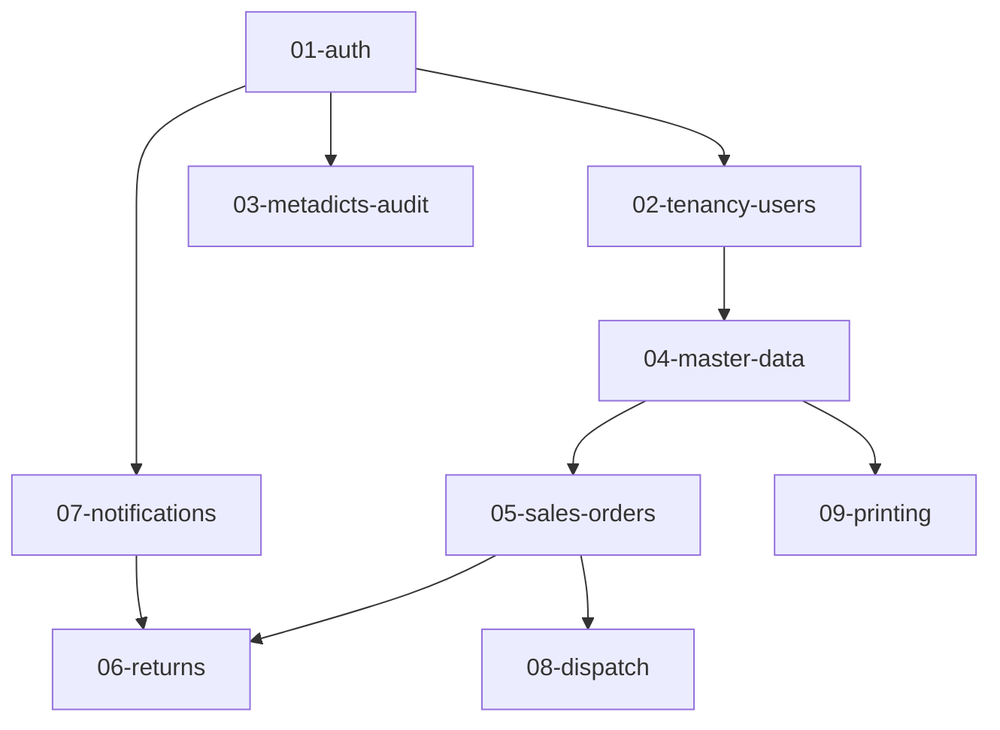

# 多公司訂出貨系統 1.0 — 計畫總索引

> **性質**：本索引為計畫目錄導覽與狀態總表。因 2026-09-18 將 backend 01~09 計畫重建為「反映現況」型（以實際程式碼盤點為準），各計畫進度以**狀態標籤**（✅完成 / 🟡部分 / ⬜未開始 / 📦歸檔）呈現，不再以 raw checkbox 數字當唯一進度來源。

## 目錄導覽

- `2026-08-05-sales-order-1.0-subproject-implementation-plan.md`（根層）：主計畫。50 Tasks 分 5 Waves，涵蓋 Backend / Web / App 三子專案
- `backend/`：後端分域實作計畫（01~09）
- `backend/detail/`：後端細部功能文件。`00-index.md` 為共通規則；01~10 對應各分域（10 = fleet 執行層 D32）
- `app/`：App 技術棧與認證基礎計畫
- `frontend/`：Web 中台計畫（2026-09-18 新增，反映 auth/users/ability 現況）
- `reference/`：原計畫（v2.9.0）。各計畫以「原計畫 Task x.y」引用
- `archive/`：歷史／完成／作廢文件

> 註：`cross-cutting/` 原含 casl-integration，已於 2026-09-18 歸檔（見 archive）。

## 執行順序與依賴（後端）

依據：02~09 沿用 01 的地基（auth/authz）；04 重用 01 的 issueTempPassword；05 對齊 04 契約；06 讀取 05 的 sales_orders 實體並採 07 的通知契約；08 與 05 共用訂單狀態機；09 的 FileStore 由 04 Task 8 提供。

## 計畫一覽（2026-09-18 盤點）

| 計畫 | 路徑 | 範圍 | 狀態 | 說明 |
|------|------|------|------|------|
| 主計畫 | `2026-08-05-sales-order-1.0-subproject-implementation-plan.md` | 三子專案 50 Tasks / 5 Waves | ⬜ 未開始（實作暫緩） | 供未來開工直接指派 |
| 01-auth | `backend/2026-08-17-backend-01-auth-plan.md` | 認證授權地基 | 🟡 部分 | OIDC/登入/JWT-session/Casbin/RLS/ability/role 權限已實作；middleware、developer/audit 待 |
| 02-tenancy-users | `backend/2026-08-17-backend-02-tenancy-users-plan.md` | 多租戶與使用者 | 🟡 部分 | Company/Department/Role CRUD 已實作；UserService 待 |
| 03-metadicts-audit | `backend/2026-08-17-backend-03-metadicts-audit-plan.md` | 字典檔與稽核 | ⬜ 未開始 | 領域無 code |
| 04-master-data | `backend/2026-08-17-backend-04-master-data-plan.md` | 主檔與檔案資產 | ⬜ 未開始 | 領域無 code |
| 05-sales-orders | `backend/2026-08-17-backend-05-sales-orders-plan.md` | 銷售訂單 | ⬜ 未開始 | 領域無 code |
| 06-returns | `backend/2026-08-17-backend-06-returns-plan.md` | 退貨 | ⬜ 未開始 | 領域無 code |
| 07-notifications | `backend/2026-08-17-backend-07-notifications-plan.md` | 通知與 FCM | ⬜ 未開始 | 領域無 code |
| 08-dispatch | `backend/2026-08-17-backend-08-dispatch-plan.md` | 派車看板 | ⬜ 未開始 | 領域無 code |
| 09-printing | `backend/2026-08-17-backend-09-printing-plan.md` | 列印與 PDF | ⬜ 未開始 | 領域無 code |
| fleet-execution（D32） | `backend/detail/10-fleet-execution.md` | Fleetbase 物流執行層 | ⬜ 未開始 | 細部文件；授權 OpenFGA/RLS 待定 |
| app-flutter-stack | `app/2026-08-04-app-flutter-stack.md` | App 技術棧與認證基礎（D29） | 🟡 部分 | 骨架/auto_route/auth 已做；solidart/disco/fquery/Sembast 未落地 |
| frontend | `frontend/2026-09-18-frontend-auth-users-plan.md` | Web 中台 auth/users/ability | 🟡 部分 | auth/ability 已實作；業務頁面待 domain |
| 原計畫 | `reference/2026-07-17-sales-order-1-0-tasks.md` | v2.9.0 執行計畫 | 📦 參考 | 各計畫以「原計畫 Task x.y」引用 |

### 📦 archive（2026-09-18 歸檔）

| 計畫 | 原路徑 | 狀態 | 歸檔原因 |
|------|------|------|------|
| go8-alignment | `backend/…go8-alignment-plan.md` | ✅ 完成（38/38） | D31 已落地 |
| casl-integration | `cross-cutting/…casl.md` | 📦 作廢 | D32 作廢 CASL（實作仍存在於 code，OpenFGA 待定） |
| plans-consolidation | `plans/…consolidation.md` | ✅ 完成 | 目錄重組已完成 |
| vibecheck | `plans/…vibecheck.md` | 📦 歷史 | 歷史驗證計畫 |

## 狀態定義

- 🟡 部分：有實際 code 產物，未完整
- ⬜ 未開始：0% 實作（可能為領域藍圖）
- ✅ 完成
- 📦 歸檔：歷史／完成／作廢，不再追蹤進度

## 維護方式

- 新增計畫時歸入對應子目錄並更新本表
- 領域落地後，將對應計畫「反映現況」更新（比照 2026-09-18 的 01/02 重建方式）
