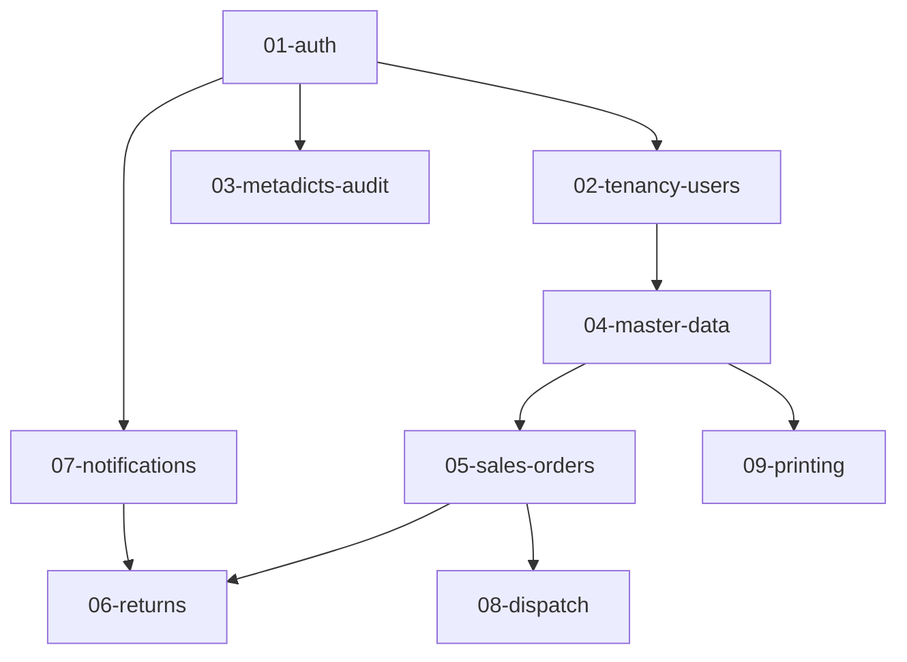

# 多公司訂出貨系統 1.0 — 計畫總索引

> **性質**：本索引為計畫目錄導覽與狀態總表。因 2026-09-18 將 backend 01~09 計畫重建為「反映現況」型（以實際程式碼盤點為準），各計畫進度以**狀態標籤**（✅完成 / 🟡部分 / ⬜未開始 / 📦歸檔）呈現，不再以 raw checkbox 數字當唯一進度來源。
>
> **現況對齊：2026-09-21**（依 codebase-memory 重新索引 14,148 nodes / 74,195 edges ＋ 程式碼、CI、測試實證）。前端 2026-09-19 四個計畫（元件庫 Phase 1／表單 Phase 2／表格 Phase 3／Ark × Tailkit v2）與 OpenFGA 前端遷移已全數落地。**同日 SaaS 化 ①（RLS 租戶隔離）完成**：全站 18 張業務表 `ENABLE`＋`FORCE`、請求層租戶交易（`dbtenant`）、四域＋核心域路徑收斂 0 殘留、9 組 `app_rw` 探針、`AGENTS.md` §9 十四條 RLS 慣例成文。**同日 SaaS 化 ④（企業級錯誤碼，P0-5）亦完成**：`internal/errcode` 碼表、`ErrorInfo` 跨網路契約、碼表與三端常數產生＋CI 同步、`AGENTS.md` §10 十條慣例成文（**現為 22 碼／19 落點**：Plan D 的 21 碼 ＋ Plan C 新增的 `PLAT-3003`）。**同日 SaaS 化 ②（platform 域與權益守衛）完成**：`00029` 的 `platform` schema 10 表、權益判定（fail-closed＋60s 快取）、配額守衛（`guardQuota` 唯一入口）、`platform/v1` 三端生成、operator 認證（獨立 secret／audience／cookie）、平台唯讀 RPC 與租戶端投影、seeds；`AGENTS.md` §11 十三條慣例成文、CI 追加 proto 產生檔漂移閘門。**③ 生命週期與 `platform-console/` 完成（2026-09-21）**：14/14 任務落地（金額套件、`SetCompanyStatus` 唯一入口、`RecordPayment` 收款唯一入口、生命週期排程、outbox consumer、`cmd/platform-cron`、Valkey 失效、平台寫入 RPC 與稽核、console 六頁、租戶端權益卡片、CI）；`00030` 建立 `platform.settings`；**注意：訂閱指派／onboarding 尚未落地，權益強制自訂閱指派起才有作用**（Plan B 未結項 #10）。
>
> 注意：`frontend/**` 計畫的 `- [ ]` 為**步驟清單**、非進度追蹤，勿以勾選數判定進度（backend 計畫才有勾選慣例）。

## 目錄導覽

- `2026-08-05-sales-order-1.0-subproject-implementation-plan.md`（根層）：主計畫。50 Tasks 分 5 Waves，涵蓋 Backend / Web / App 三子專案
- `backend/`：後端分域實作計畫（01~09）
- `backend/detail/`：後端細部功能文件。`00-index.md` 為共通規則；01~10 對應各分域（10 = fleet 執行層 D32）
- `app/`：App 技術棧與認證基礎計畫
- `frontend/`：Web 中台計畫（2026-09-18 起，6 份）：`auth-users`（現況對齊）、`openfga-authz-frontend`（CASL→權限集合遷移）、`ui-library-phase1`、`forms-tanstack-phase2`、`tables-phase3`、`tailkit-ark`（Ark 行為 × Tailkit 視覺）
- `reference/`：原計畫（v2.9.0）。各計畫以「原計畫 Task x.y」引用
- `archive/`：歷史／完成／作廢文件

> 註：`cross-cutting/` 原含 casl-integration，已於 2026-09-18 歸檔（見 archive）。

## 執行順序與依賴（後端）

依據：02~09 沿用 01 的地基（auth/authz）；04 重用 01 的 issueTempPassword；05 對齊 04 契約；06 讀取 05 的 sales_orders 實體並採 07 的通知契約；08 與 05 共用訂單狀態機；09 的 FileStore 由 04 Task 8 提供。

## 計畫一覽（2026-09-20 盤點）

| 計畫 | 路徑 | 範圍 | 狀態 | 說明 |
|------|------|------|------|------|
| 主計畫 | `2026-08-05-sales-order-1.0-subproject-implementation-plan.md` | 三子專案 50 Tasks / 5 Waves | 🟡 部分 | Wave 1 多數、Wave 2 部分已由 backend 01~04 分批落地（見下列分域計畫）；Wave 3~5（訂單/退貨/通知/派車/列印、Web 業務頁、App 業務）未開工 |
| SaaS 化 ①：RLS 租戶隔離 | `2026-09-20-rls-tenant-isolation-plan.md` | 租戶隔離啟用（SaaS spec 第①步） | ✅ **完成（2026-09-20）** | 10 tasks ＋ 收尾修正（Task 11）全數落地：`00022` app_rw 非 owner 角色、`00023` 18 個 policy（`WITH CHECK`／`NULLIF`）、`00024`–`00028` 全站 18 張業務表 `ENABLE`＋`FORCE`、請求層租戶交易（`dbtenant`：Interceptor／Client／TxFrom／SystemScopeTx／AfterCommit）、四域＋核心域路徑全數收斂（0 殘留）、T5–T11 共 9 組 `app_rw` 探針（含 scope 矩陣、子表傳遞性、跨租戶端到端、seed、登入全鏈、佈建、錯誤遮蔽、production 角色守護）、`AGENTS.md` §9 十四條慣例。驗證：`task check` 與全套整合測試 EXIT=0 |
| SaaS 化 ②：platform 域與權益守衛 | `2026-09-20-platform-entitlements-plan.md` | platform schema／entitlement／守衛（SaaS spec 第②步） | ✅ **完成（2026-09-20）** | 12 tasks／73 steps 全數落地：`00029` 的 `platform` schema 與 **10 表**（`app_rw` 零權限）、唯讀 store（介面＋假實作＋`database/sql`）、權益判定（fail-closed／真 TTL 快取 60s）、計數器（**公司層讀取**）與四個服務注入、**6 個**寫入守衛（`guardQuota` 唯一入口；super／developer 依 spec §4.3 略過）、`platform/v1` 三端生成、`operatorauth`（獨立 secret／audience、`platform_session` cookie `Path=/platform`）、`PlatformAdminService`（`/platform/` 掛載、`requestid`＋operator interceptor、LATERAL 取 cancelled、排除平台自營公司）、`TenantEntitlementService` 租戶端投影、seeds（features 7／方案 3／價目 6／權益 16／首位 operator）。`AGENTS.md` §11 十三條慣例成文；CI 新增 proto 產生檔漂移閘門。**延後項**（計畫 Progress「未結項」有現況／選項／歸屬）：席位與客戶帳號的口徑矛盾待產品裁定、`RestoreDepartment` 缺口移交 02、`platform.settings`（Plan C 的 `00030`）與 seed `DO UPDATE` 對 console 編輯的互動、`limit.storage_gb` 待 FileStore、v1 無登出端點、`platform-console/` 未落地（**此列為 Plan B 交付時的值**）。**交付後全分支審查修正輪另修 8 項**（真 RLS 下席位守衛原本數到 0、`cancelled` 被當成「從未訂閱」而不限額、`none` 阻斷登入與註冊、未知訂閱狀態 fail-open、投影降級文字、請求 ctx、兩條未守衛建帳號路徑、registration token 消費順序），**未結項增至 13 項**（含 ⚠️ **在訂閱被指派前權益強制不會發生**（**已由 Plan C 解決**：`platform-console/` 六頁與 T15 的營運開通介面 `CreateSubscription`）、投影與守衛對 `none` 不一致、席位 vs 客戶帳號口徑待產品定調）。**③ 生命週期與 console 已於 2026-09-21 完成**（見下一列；Plan B 未結項 #10 的「訂閱指派前權益不生效」仍是上線注意事項） |
| SaaS 化 ③：生命週期與平台營運工具 | `2026-09-20-platform-lifecycle-console-plan.md` | 收款、排程、`platform-console/` 六頁（SaaS spec 第③步） | ✅ **完成（2026-09-21）** | **15 tasks 全數落地**（35 commits；含最終全分支審查 B-1 的補救任務 T15 與其後的最終修正波）：金額套件（int64 分、禁 float）、`SetCompanyStatus` 成為公司狀態唯一入口、`RecordPayment` 為收款唯一入口（狀態機表驅動、冪等、憑據只寫一次）、生命週期排程（下一期／逾期／凍結／取消期末，含 `AND cur.status='open'` 的 C-1 修正與第一期錨點）、outbox consumer（三個事件映射、條件式認領）、`cmd/platform-cron` 單趟排程（advisory lock／`--timeout`／panic 復原）、Valkey 快取失效（三個寫入來源、提交後才失效）、`00030` `platform.settings`、**12 支平台寫入 RPC**（**5 走 `billing`**：開通／收款／席位／改方案／取消；7 走服務層 `writeTx`；資料與稽核同交易、`reason` 必填）、移除唯讀時期的 `recordPlatformAudit`、**console 六頁**（自有 Vite／路由／守衛，只走 `platform/v1`）、租戶後台唯讀權益卡片、CI 新增 `platform-console` job（typecheck／lint／test／build）。**`AGENTS.md` §11 由 14 條長到 23 條**；spec 就地更正 5 處（逾期謂詞、事件 `reason` 契約、`PLAT-3002` 多語意、快取 TTL 措辭、角色矩陣待辦）。**未結項**：計畫 Progress 的「未結項」表 **44 列**（現況／選項／歸屬），主要群＝**角色×RPC 矩陣**（需 `GetOperatorSelf`）、**期別歷史 RPC**、**開票三欄的 UI**、**試用／寬限顯示**、**「無訂閱列」的投影形狀待定**、排程告警（「服務中卻沒有 open 期別」）、**store 層的 `reason` 只擋空字串**（新增寫入點必須自己 trim）。**注意：訂閱指派／onboarding 已於 T15 落地**（`CreateSubscription`：訂閱＋第一期＋事件＋稽核同一交易；`trialing` 也有到期路徑 `ExpireTrials`）→ Plan B 未結項 #10 的「權益強制不生效」不再成立 |
| SaaS 化 ④：企業級錯誤碼系統 | `2026-09-20-error-codes-plan.md` | 對外錯誤碼契約（P0-5，與 Plan A 並行） | ✅ **完成（2026-09-20）** | 7 tasks／39 steps 全落地：`ErrorInfo{code,message,details,trace_id}` 三端、`internal/errcode` registry（常數即註冊、啟動驗證格式／唯一性／區段規則）、`trace_id` 於回應邊界注入（middleware 閘門另補）、`toConnectError` 走 registry、**21 碼**（SYS 7／AUTH 7／PLAT 4／CUST 3，**17 碼已落點**——皆為 **Plan D 交付時**的值）、基線守門（**98 行／233 呼叫點**，只減不增）、碼表＋三端常數由 `go generate ./internal/errcode` 產生且 CI 驗同步、`AGENTS.md` §10 慣例。**Task 5b 已隨 Plan B 落點 3 碼（`PLAT-3001`／`PLAT-5001`／`PLAT-5002`）；`PLAT-3002` 已隨 Plan C 的收款路徑落點，Plan C 另新增 `PLAT-3003`（現況 **22 碼／19 落點**）** |
| 01-auth | `backend/2026-08-17-backend-01-auth-plan.md` | 認證授權地基 | 🟡 部分 | OIDC/登入/JWT-session/Casbin/RLS 語句/ability/role 權限、middleware（authzMiddleware/protectedRPC）、developer 逃生門（SeedDeveloper）、audit 地基（audit.Recorder DB）、Argon2id、首登受限態（A3）已實作；OpenFGA 內嵌＋Provision＋fail-fast（F2）、testcontainers 整合測試政策與 CI `go-integration`（2026-09-19）已落地；**RLS 已於 2026-09-20 全站 ENABLE＋FORCE（Plan A 完成，18 張業務表、請求層租戶交易）**、CASL 引擎仍在（D32 待遷移） |
| 02-tenancy-users | `backend/2026-08-17-backend-02-tenancy-users-plan.md` | 多租戶與使用者 | 🟡 部分 | Company/Department/Role CRUD 已實作；UserService 7 支 RPC 已落地（含稽核＋`dataScopeForUser`）；公司停用連鎖(2.1.3)（2026-09-18, A2）；公司/部門改**軟刪除**（partial unique index）＋刪除競態互斥鎖（FOR SHARE／FOR UPDATE）＋清單 `sort/desc` 白名單（2026-09-20）；主帳號連鎖(D22)待 |
| 03-metadicts-audit | `backend/2026-08-17-backend-03-metadicts-audit-plan.md` | 字典檔與稽核 | ✅ 完成 | metadicts（6 RPC + 合併查詢 + ListOptions）與稽核查詢 API（AuditService.List, D27 時間窗）全落地（2026-09-18）；audit.Recorder DB（00009/00010）已由 02 提前落地 |
| 04-master-data | `backend/2026-08-17-backend-04-master-data-plan.md` | 主檔與檔案資產 | 🟡 部分 | 3.1.1–3.1.4（customers CRUD＋取號＋D22 帳號交付）、3.1.5 欄位（`preferred_delivery_days`/`promo_tag_ids`）、3.2 地址簿＋聯絡人、3.3 商品三實體＋單位換算、3.4 部門級四主檔（warehouse/route/processing_spec/product_category）已落地（2026-09-18~19）；3.5 客戶專屬商品（`CustomerProductService`＋00033／00034）、3.6 檔案資產（`domain/fileassets` 驗證＋儲存＋REST＋00035／00036）、3.8 QR 兌換（`qrcode` 簽章＋`GetCustomerQRCode`＋兌換端點）已落地（2026-09-21~22）；Logo 上傳待 |
| 05-sales-orders | `backend/2026-08-17-backend-05-sales-orders-plan.md` | 銷售訂單 | 🟡 部分 | 後端已落地：`SalesOrderService`（List/Get/Create/Update/Cancel/Complete/Void/Delete＋ListOrderEvents）、狀態機 `TransitionOrder`、訂單取號、00031 schema＋00032 RLS ENABLE＋FORCE；Web/App 業務頁待 |
| 06-returns | `backend/2026-08-17-backend-06-returns-plan.md` | 退貨 | ⬜ 未開始 | 領域無 code |
| 07-notifications | `backend/2026-08-17-backend-07-notifications-plan.md` | 通知與 FCM | ⬜ 未開始 | 領域無 code |
| 08-dispatch | `backend/2026-08-17-backend-08-dispatch-plan.md` | 派車看板 | ⬜ 未開始 | 領域無 code（訂單 `route_id`／`delivery_sequence` 欄位已備，派車寫入走 `TransitionOrder` dispatch 路徑） |
| 09-printing | `backend/2026-08-17-backend-09-printing-plan.md` | 列印與 PDF | ✅ 完成（2026-09-22） | Tasks 1–4 全數落地：`internal/print`（view model＋四模板＋Gotenberg client＋PDF 產線）、printlog／printpreview schema（00037）、Preview／Print／ListLogs RPC、00038 RLS ENABLE＋FORCE、全整合綠 ok=30 fail=0 |
| fleet-execution（D32） | `backend/detail/10-fleet-execution.md` | Fleetbase 物流執行層 | ⬜ 未開始 | 細部文件；授權 OpenFGA/RLS 待定 |
| app-flutter-stack | `app/2026-08-04-app-flutter-stack.md` | App 技術棧與認證基礎（D29） | 🟡 部分 | Task 1（骨架）✅、Task 5/6/7（token/auth transport/router）部分；core/config、QueryCache、Sembast 鏡像、fquery 慣例、根佈線未落地 |
| frontend-auth-users | `frontend/2026-09-18-frontend-auth-users-plan.md` | Web 中台 auth/users/ability | 🟡 部分 | 15/17 打勾：登入雙 tab、403、Google OIDC、公司/部門/角色三頁＋PermissionMatrix＋分頁、`requireAbility` 路由守衛已完成；待辦為使用者管理頁與各業務頁（相依 04/05/08/09） |
| frontend-openfga | `frontend/2026-09-18-openfga-authz-frontend-plan.md` | CASL → 權限集合遷移 | ✅ 完成 | F1–F4 全落地：`permissions.ts`（Set 查詢）、`service.ts` 載入權限集合、`Can`/`guards` 改用 `hasPermission`、`@casl/ability` 已自依賴移除 |
| frontend-ui-library（Phase 1） | `frontend/2026-09-19-frontend-ui-library-phase1-plan.md` | UI 元件庫化 | ✅ 完成 | barrel＋`registry.json`＋每元件 `.md`＋dev-only `/ui` demo；Field/ScrollArea/Pagination 改 Ark（對外 API 不變、刪死碼 `label.tsx`）；sidebar 多部件；深色模式三態＋anti-FOUC；AppShell 換用新 sidebar/splitter |
| frontend-forms（Phase 2） | `frontend/2026-09-19-frontend-forms-tanstack-phase2-plan.md` | 表單 | ✅ 完成 | 登入／公司／部門三表單改 TanStack Form ＋ valibot 欄位級驗證 |
| frontend-tables（Phase 3） | `frontend/2026-09-19-frontend-tables-phase3-plan.md` | 表格與資料層 | ✅ 完成 | 三表改 TanStack Table（manual）＋ solid-query 資料層 ＋ 伺服器端排序（後端 `sort/desc` 白名單、六清單補 id tie-break） |
| frontend-tailkit-ark（v2） | `frontend/2026-09-19-frontend-tailkit-ark-plan.md` | Ark 行為 × Tailkit 視覺 | ✅ 完成 | T1–T10 落地：`@tailwindcss/forms`/`typography`、`dark` variant 對齊、14 個本地元件重寫（dialog/tabs/checkbox 走 Ark）、app shell、5 頁換皮、Nikala/Kobalte 清理；色階字面值 0 命中 |
| 原計畫 | `reference/2026-07-17-sales-order-1_0-tasks.md` | v2.9.0 執行計畫 | 📦 參考 | 各計畫以「原計畫 Task x.y」引用 |

### 📦 archive（2026-09-18 歸檔）

| 計畫 | 原路徑 | 狀態 | 歸檔原因 |
|------|------|------|------|
| go8-alignment | `backend/…go8-alignment-plan.md` | ✅ 完成（38/38） | D31 已落地 |
| casl-integration | `cross-cutting/…casl.md` | 📦 作廢 | D32 作廢 CASL（實作仍存在於 code，OpenFGA 待定） |
| plans-consolidation | `plans/…consolidation.md` | ✅ 完成 | 目錄重組已完成 |
| vibecheck | `plans/…vibecheck.md` | 📦 歷史 | 歷史驗證計畫 |

## 狀態定義

- 🟡 部分：有實際 code 產物，未完整
- ⬜ 未開始：0% 實作（可能為領域藍圖）
- ✅ 完成
- 📦 歸檔：歷史／完成／作廢，不再追蹤進度

## 維護方式

- 新增計畫時歸入對應子目錄並更新本表
- 領域落地後，將對應計畫「反映現況」更新（比照 2026-09-18 的 01/02 重建方式）
