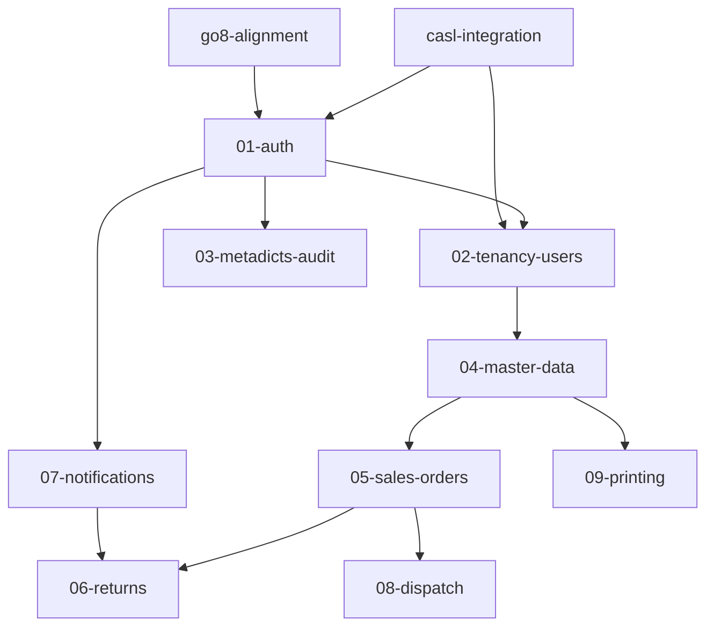

# 多公司訂出貨系統 1.0 — 計畫總索引

> 狀態與進度由 checkbox 掃描產生；最後掃描：2026-08-31

## 目錄導覽

- `2026-08-05-sales-order-1.0-subproject-implementation-plan.md`（根層）：主計畫。50 Tasks 分 5 Waves，涵蓋 Backend / Web / App 三子專案
- `backend/`：後端分域實作計畫（01~09）+ go8 架構對齊計畫
- `backend/detail/`：後端細部功能文件。`00-index.md` 為共通規則；01~09 對應各分域
- `app/`：App 技術棧選型計畫
- `cross-cutting/`：橫切前後端的整合計畫
- `reference/`：原計畫（v2.9.0）。各計畫以「原計畫 Task x.y」引用
- `archive/`：歷史文件
- 尚無前端專屬計畫；Web 端工作目前散見於主計畫與 cross-cutting

## 執行順序與依賴

**前置修正**（修改計畫文件本身，須先於對應實作落地）：

1. `backend/2026-08-24-backend-go8-alignment-plan.md` — D31 架構慣例（config 分檔、`InitDomains()`、cmd 拆分）落地到各計畫文件
2. `cross-cutting/2026-08-24-casl-integration-plan.md` — CASL 規則格式（conditions/inverted/sort_order）落地到 01/02 細部文件與前端 ability 結構

**後端實作順序**：

依據：02~09 沿用 01 的地基（testutil、middleware.Authenticate、audit.Recorder）；04 重用 01 的 issueTempPassword 與 02 的 Logo；05 對齊 04 契約；06 讀取 05 的 sales_orders 實體並採 07 的通知契約；08 與 05 同套件共用訂單狀態機；09 的 FileStore 由 04 Task 8 提供。

## 計畫一覽

| 計畫 | 路徑 | 範圍 | 進度 | 狀態 | 依賴 |
|------|------|------|------|------|------|
| 主計畫 | `2026-08-05-sales-order-1.0-subproject-implementation-plan.md` | 三子專案 50 Tasks / 5 Waves | 5/298 | 進行中 | — |
| go8-alignment | `backend/2026-08-24-backend-go8-alignment-plan.md` | 後端結構對齊（D31） | 38/38 | 完成 | 無；須先於 01 實作 |
| casl-integration | `cross-cutting/2026-08-24-casl-integration-plan.md` | CASL 前後端整合 | 0/71 | 未開始 | 無；須先於 01/02 實作 |
| 01-auth | `backend/2026-08-17-backend-01-auth-plan.md` | 認證授權地基 | 0/75 | 未開始 | go8、casl |
| 02-tenancy-users | `backend/2026-08-17-backend-02-tenancy-users-plan.md` | 多租戶與使用者 | 0/38 | 未開始 | 01、casl |
| 03-metadicts-audit | `backend/2026-08-17-backend-03-metadicts-audit-plan.md` | 字典檔與稽核 | 0/28 | 未開始 | 01 |
| 04-master-data | `backend/2026-08-17-backend-04-master-data-plan.md` | 主檔與檔案資產 | 0/44 | 未開始 | 01、02 |
| 05-sales-orders | `backend/2026-08-17-backend-05-sales-orders-plan.md` | 銷售訂單 | 0/23 | 未開始 | 04 |
| 06-returns | `backend/2026-08-17-backend-06-returns-plan.md` | 退貨 | 0/18 | 未開始 | 01、04、05、07 |
| 07-notifications | `backend/2026-08-17-backend-07-notifications-plan.md` | 通知與 FCM | 0/40 | 未開始 | 01 |
| 08-dispatch | `backend/2026-08-17-backend-08-dispatch-plan.md` | 派工看板 | 0/26 | 未開始 | 05 |
| 09-printing | `backend/2026-08-17-backend-09-printing-plan.md` | 列印與 PDF | 0/34 | 未開始 | 04 |
| app-flutter-stack | `app/2026-08-04-app-flutter-stack.md` | App 技術棧（D29） | 0/51 | 未開始 | 主計畫 Task 5 |
| 原計畫 | `reference/2026-07-17-sales-order-1-0-tasks.md` | v2.9.0 執行計畫 | 0/407 | 未開始 | — |
| vibecheck | `archive/2026-08-03-sales-order-1.0-vibecheck-plan.md` | 歷史驗證計畫 | — | 歸檔 | — |

## 狀態定義

- 未開始：0% checkbox 完成
- 進行中：>0% 且 <100%
- 完成：100%
- 歸檔：歷史文件，不再追蹤進度

## 維護方式

- 新增計畫時歸入對應子目錄並更新本表
- 進度數字以 checkbox 掃描為準，執行計畫時定期更新「最後掃描」日期與本表
