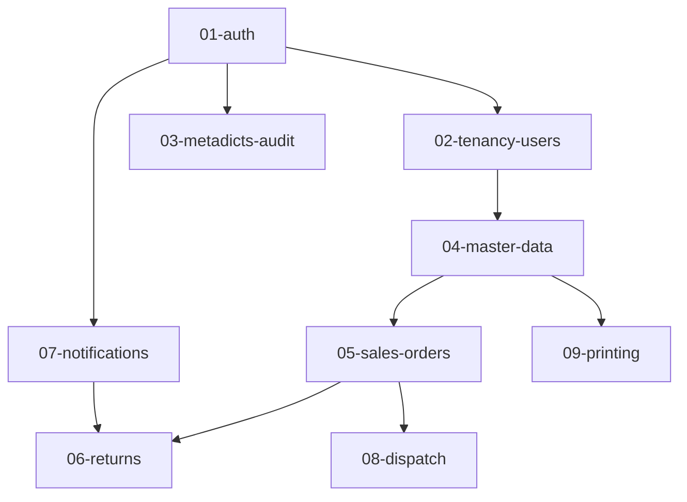

# 計畫總索引

> **性質**：本檔是 `plans/` 的導覽與**未完成項**追蹤。計畫狀態定義見文末。
>
> **現役權威**：系統「現在長怎樣」→ `docs/AGENTS.md`；「範圍與合約」→ `specs/1.0-contract.md`；「決策」→ `specs/decisions.md`；「可驗證行為」→ `specs/1.0-requirements/`；「各分域怎麼做的規格」→ `plans/backend/detail/`。
>
> **規則**：計畫完成即 `git rm`（git history 就是檔案庫）；本檔不留逐日流水帳，只留**仍未結案的事項**。主計畫（`2026-08-05-…-subproject-implementation-plan.md`）在 Task 50 完成後同樣刪除，其現況併入 `docs/AGENTS.md` §9。

---

## 目錄導覽

- `backend/detail/`：**後端各分域現況規格**（00-index 為共通規則；01~09 對應分域；10 = logistics 執行層 D32）。這是後端「怎麼做」的權威。
- `backend/`：**未完成的**後端計畫。已完成域的計畫已刪除（現役細節看 `detail/`）。
- `frontend/`：Web 中台計畫。`2026-09-18-frontend-auth-users-plan.md` 仍在用（其餘業務頁待補）。
- `app/`：App 技術棧計畫（`2026-08-04-app-flutter-stack.md`，仍為部分完成）。
- `2026-08-05-sales-order-1.0-subproject-implementation-plan.md`（根層）：主計畫（三子專案 50 Tasks / 5 Waves）。

## 執行順序與依賴（後端）

```mermaid
graph TD
    b01[01-auth] --> b02[02-tenancy-users]
    b01 --> b03[03-metadicts-audit]
    b02 --> b04[04-master-data]
    b04 --> b05[05-sales-orders]
    b01 --> b07[07-notifications]
    b07 --> b06[06-returns]
    b05 --> b06
    b05 --> b08[08-dispatch]
    b04 --> b09[09-printing]
```

依據：02~09 沿用 01 的地基（auth/authz）；04 重用 01 的 issueTempPassword；05 對齊 04 契約；06 讀取 05 的 sales_orders 實體並採 07 的通知契約；08 與 05 共用訂單狀態機；09 的 FileStore 由 04 Task 8 提供。

## 計畫一覽

| 計畫 | 路徑 | 狀態 | 說明 |
|------|------|------|------|
| 主計畫 | `2026-08-05-sales-order-1.0-subproject-implementation-plan.md` | 🟡 部分 | Task 47/48/49 完成；**Task 50 部署與維運未開始**（無 Helm／k8s／metrics 端點，唯一上線阻斷項） |
| 01-auth | `backend/2026-08-17-backend-01-auth-plan.md` | 🟡 部分 | OpenFGA＋RLS 全面接手（D32）；殘項見 `detail/01-auth.md` |
| 02-tenancy-users | `backend/2026-08-17-backend-02-tenancy-users-plan.md` | 🟡 部分 | D22 主帳號連鎖、Logo 上傳、X-Api-Token 已落地；殘：深層連結網域與 `/.well-known/*` 未部署 |
| 03-metadicts-audit | `backend/detail/03-metadicts-audit.md` | ✅ 完成 | 實作計畫已刪（完成即 `git rm`） |
| 04-master-data | `backend/2026-08-17-backend-04-master-data-plan.md` | 🟡 部分 | 殘：3.1.5 完整驗證與促銷連動（07 promo_tags） |
| 05-sales-orders | `backend/detail/05-sales-orders.md` | ✅ 後端完成 | 實作計畫已刪 |
| 06-returns | `backend/detail/06-returns.md` | ✅ 完成 | 實作計畫已刪 |
| 07-notifications | `backend/2026-08-17-backend-07-notifications-plan.md` | 🟡 部分 | 殘：Firebase 原生設定檔未提供（缺席時靜默跳過） |
| 08-dispatch | `backend/detail/08-dispatch.md` | ✅ 完成 | 實作計畫已刪 |
| 09-printing | `backend/detail/09-printing.md` | ✅ 完成 | 實作計畫已刪 |
| frontend-auth-users | `frontend/2026-09-18-frontend-auth-users-plan.md` | 🟡 部分 | 已落地 17 頁；待辦為其餘業務頁 |
| app-flutter-stack | `app/2026-08-04-app-flutter-stack.md` | 🟡 部分 | core/config、Sembast 鏡像未落地 |

## 未完成項（唯一權威）

> 來源：原缺口盤點與實作優先序（G1–G16，其中 G1–G8 已定案並落地；該檔已刪除），加上各計畫收尾時留下的「未結項」。

### 阻斷上線

| # | 項目 | 現況 | 下一步 |
|---|---|---|---|
| U1 | **Task 50 部署與維運未開始** | 無 Helm／k8s／metrics 端點；`app` 無 `firebase.json`／Dockerfile／fastlane，CI 的 `flutter` job 只做 `pub get` + `analyze`，不建置 App | 建部署管線；App 原生建置問題需在本機以 `--flavor dev` 實機把關 |
| U2 | **`cmd/platform-cron` 尚無自動執行環境** | 只能人工 `task platform:cron`，等於「逾期自動凍結」不會發生 | `docker-compose.dev.yml` 加 cron 容器（k8s CronJob 待 D19）＋最小告警（連續 N 天無摘要即告警） |
| U3 | **帳務備份還原演練未做過** | D19 的 RTO/RPO 是整體指標，未分辨帳務 | 至少一次 `platform` schema 還原演練（證明 `subscription_periods`／平台稽核救得回） |
| U4 | **D21 的 70% 覆蓋率 CI 門檻未落地** | 三端 CI 無覆蓋率門檻 | go 以 `-coverprofile`、前端 vitest coverage；建議先設 60% 再往上 |

### 產品語意待定調

| # | 項目 | 現況 | 待誰定 |
|---|---|---|---|
| U5 | 席位數口徑矛盾 | spec §3.2（席位＝非停用帳號）與 §4.5（只有 CreateUser 受 `limit.seats` 管）衝突；`CreateCustomer` 的附帶帳號目前也佔席 | 產品 |
| U6 | `reactivated` 會解除「管理員手動停用」的公司 | 公司狀態只有一個列舉，不區分停用來源 | 產品／spec 擁有者 |
| U7 | 試用期長於一期時，第一期在試用期內到期且不被催收 | `EnsureNextPeriod` 與催收謂詞需同時改；產品語意未定調前不得動謂詞 | 產品 |
| U8 | 開票資訊無租戶端入口 | 平台端 `RecordPayment` 有 `buyer_tax_id`／`carrier`，但要打電話問客戶 | 產品（v1 可先做租戶後台欄位） |
| U9 | 平台稽核保留期未定 | D27 的 1/3/6/12 月是為**業務**稽核設計；帳務稽核法遵上通常要 5–7 年 | 產品／法遵 |

### 待補的 API 與功能

| # | 項目 | 現況 | 歸屬 |
|---|---|---|---|
| U10 | 資料匯出（合約終止後客戶帶走資料） | 目前只說「不刪除」；v1 以人工 SQL 匯出並記錄在案 | 1.1 |
| U11 | 促銷推播（`promo_tags` 分類標籤選群，D24） | ⬜ 未開始 | 07 後續 |
| U12 | App 的 `FailedPrecondition`（方案未含/超額）友善呈現 | 三份計畫皆寫「app 不在範圍」；錯誤碼呈現應早於 App 業務頁 | App 下一波 |
| U13 | `PLAT-3002` 重試語意仍待結構化鍵 | `details.kind` 已有 `ref_mismatch`／`amount_mismatch`／`cross_period`；spec §4.3「不得據此放棄重試」缺鍵 | `platform/v1` 下一計畫 |
| U14 | 唯一鍵衝突（`MarkPeriodPaidTx`）無 `details.reason` | 走通用指引 | `platform/v1` 下一計畫 |

### 技術債（不阻斷，但要有人記著）

| # | 項目 | 現況 | 歸屬 |
|---|---|---|---|
| U15 | `SetSeatCount` 守衛的交易外讀取（TOCTOU）、`UpdateBillingSettings` 的 before 交易外讀取等六項 | 已註記收斂方向為 billing 內复核 | `platform_admin_service` |
| U16 | `recordAuditTx` 的 `reason` 只擋空字串不 trim | `TrimSpace` 後判定已修；相關 fake 同步 | 已修 |
| U17 | 租戶詳情頁的 `RFC3339` 到期日檢查寬鬆但訊息嚴格 | 其餘（`now` 每分鐘 tick）已修 | `platform-console` |
| U18 | 收款表單的 `invoice_status`／`buyer_tax_id`／`carrier` CSV 下載未真機驗證 | CSV 只含目前頁已在文案明示 | `platform-console` |
| U19 | 稽核頁與收款頁自身的查詢錯誤態無專屬測試 | — | `platform-console` |
| U20 | 權益快取的 `MemoryCache` 分支今日不可達；`TestJudgementSurvivesCacheFailure` 改動行程級 logger | 故障 log 節流已修 | `entitlements` |
| U21 | `Commandable`／`EventBatch` 雙入口；`--date` 不得早於現在 24h 已修 | `Summary.Locked` 欄位序 | `platform/cron` |
| U22 | 任何只回報「全綠」而不帶 `-count=1` 的守門指令都可能命中快取 | `task test:integration` 已修 | 全 repo Taskfile／CI 慣例 |
| U23 | 平台側沒有第二道防線（`platform` 表不套 RLS，授權全靠服務層） | 緩解：`app_rw` 零權限 | 每次新增平台 RPC 都要有服務層檢查與測試 |
| U24 | `money.YearlyFromMonthly` 無生產呼叫端 | 價目尚未有 `discount_bps`；函式保留並註明 | 價目加折扣時由它負責算，勿另寫一份 |
| U25 | `trial_ends_at IS NULL` 的 `trialing` 訂閱 | 排程摘要 `StuckTrialing` 計數已加 | 可考慮 `CHECK` 約束 |
| U26 | `frontend/scripts/casl-golden-gen.mjs` 已失效（CASL 已移除） | 待刪 | frontend |

## 狀態定義

- 🟡 部分：有實際 code 產物，未完整
- ⬜ 未開始：0% 實作
- ✅ 完成
- 📦 歸檔：歷史／完成／作廢（**改以 `git rm` 取代，不再保留目錄**）

## 維護方式

1. 新增計畫歸入對應子目錄，並更新本表。
2. **計畫完成即 `git rm`**，其現況以 `detail/`（後端）或 `docs/AGENTS.md` 為準。
3. 本檔只追蹤**未完成項**；已完成的事不寫在這裡，寫進 `docs/AGENTS.md` 或 commit message。
