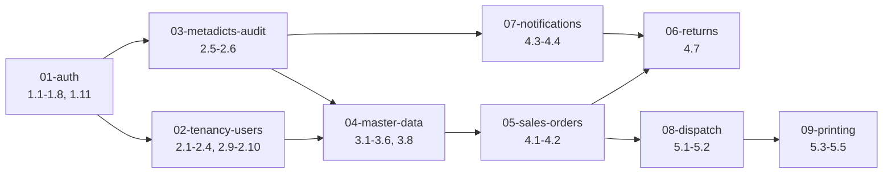

# Backend Phase 1–5 細部實作計畫 — 總覽

> 版本:v1.0.0(2026-08-17)
> 依據:執行計畫 `docs/superpowers/plans/reference/2026-07-17-sales-order-1-0-tasks.md`(v2.9.0)、規格書 v1.0.34、決策記錄 D1–D28。
> 定位:本目錄為原計畫 **backend 部分(Task 導向)的細部分解**,將每個 Task 拆成可獨立驗收的子功能,並補上實作邏輯與錯誤處理。**不取代、不修改原計畫**;原計畫仍為進度勾選基準,本目錄為實作時的邏輯依據。
> 範圍:Phase 1–5 的 backend 工作。Phase 0(基礎建設)、Phase 6(App)、Phase 7(公告/UI)、Phase 8(部署)不在本目錄;混合 Task(含前端/App)僅拆後端部分並於文中註明。

---

## 1. 文件地圖

| 文件 | 涵蓋 Task | 主題 |
|---|---|---|
| `01-auth.md` | 1.1–1.8、1.11 | 認證(Session/JWT/OAuth2/客戶帳密)、Casbin、RLS、developer 逃生門 |
| `02-tenancy-users.md` | 2.1–2.4、2.9、2.10 | 公司/部門/使用者、角色權限、Casbin policy 管理 |
| `03-metadicts-audit.md` | 2.5、2.6 | 字典檔、稽核日誌 |
| `04-master-data.md` | 3.1–3.6、3.8 | 客戶/商品/倉別/車次/分切規格/分類/專屬商品/檔案/QR |
| `05-sales-orders.md` | 4.1、4.2 | 訂單、狀態機、取號、下單邏輯 |
| `06-returns.md` | 4.7 | 退貨申請與審核(僅後端) |
| `07-notifications.md` | 4.3、4.4 | 通知範本、FCM/站內發送、裝置管理 |
| `08-dispatch.md` | 5.1、5.2 | 派車、Connect 串流看板(僅後端) |
| `09-printing.md` | 5.3–5.5 | 四種單據模板、Gotenberg、列印記錄 |

原計畫各 Phase 驗收 Task(1.12、2.12、3.9、4.8、5.7)不拆,驗收時回到原計畫勾選。

## 2. 子功能編號與模板

- 編號:`Task號.序號`(如 `1.5.1`),可雙向追溯原計畫 Task。
- 每個子功能固定六欄:**目標 / 檔案 / 介面 / 實作邏輯 / 錯誤處理 / 驗收**。
- 一個子功能 = 一個可獨立驗收的行為單元(一條 RPC、一個事務流程、一個機制)。

## 3. 共通規則(各文件只引用、不重複)

1. **交易與稽核**:取號 + 建檔、狀態異動 + 事件軌跡、業務操作 + audit log,皆同一 DB 交易,同成功同失敗(D18)。子功能「實作邏輯」欄明確標出交易邊界。
2. **軟刪除**:業務實體統一 `deleted_at` + 部分唯一索引(D10);查詢預設排除;復原 = 清欄位 + 寫稽核。特殊規則(如 `customer_products` qty=0 保留)於各子功能註明。
3. **多租戶**:每筆業務資料帶 `company_id` / `department_id`;Casbin 管功能(domain = company_id)、RLS 管資料範圍(`data_scope` 等級)、CASL 管 UI(D3)。RLS 注入(`app.current_company_id` / `app.current_department_id` / `app.current_data_scope`)為最後防線。
4. **錯誤處理約定**:統一以 Connect code 表述 —
   - `unauthenticated`:登入失效、token_version 不符
   - `permission_denied`:角色/範圍不符、主帳號呼叫業務 API
   - `not_found`:資源不存在或已被軟刪除
   - `failed_precondition`:狀態機不允許、樂觀鎖衝突(前端重查)、臨時密碼過期、帳號鎖定
   - `invalid_argument`:輸入驗證失敗
   - `already_exists`:唯一約束衝突(前綴、別名、identifier)
5. **測試約定**:每個子功能「驗收」欄對應可執行測試行為;取號併發、狀態機轉移、RLS 隔離、退貨審核、送貨日順延、鎖定解除六類需整合測試(D21);三端覆蓋率 70% CI 強制。各文件結尾附「整合測試重點」。
6. **依賴標註**:子功能間先後依賴於「目標」欄標註 `相依: X.Y.Z`;全域依賴見下節。

## 3.7 架構慣例(D31,2026-08-24 起生效)

### 目錄結構

```
backend/
├── cmd/
│   ├── server/main.go      # 極薄入口:config.New() → server.New(cfg) → s.Init() → s.Run()
│   ├── migrate/main.go     # goose up/down/create CLI
│   └── seed/main.go        # 冪等 seeder 入口(roles/預設 policies/developer 帳號)
├── config/                 # 逐檔 struct + constructor(envconfig),config.go 僅聚合
│   ├── config.go  api.go  auth.go  cache.go  database.go  storage.go  observability.go
├── internal/
│   ├── server/server.go    # Server struct 註冊全部依賴 + Init()
│   ├── server/domains.go   # InitDomains():逐 domain 組裝 repo→usecase→handler
│   └── (domain/ middleware/ authz/ session/ database/ audit/ 既有路徑不變)
├── third_party/
│   ├── database/ent.go     # Ent client + pgx pool 初始化
│   └── cache/valkey.go     # Valkey client 初始化
├── proto/  ent/  database/migrations/  .air.toml  Taskfile.yml
```

### DI 與啟動

- `Server` struct 持有全部共享依賴(Config、*ent.Client、Valkey、Casbin enforcer、casl FieldRegistry、scs manager、chi router)。
- 所有 fail-fast 啟動檢查集中於 `Server.Init()`:DB/Valkey 連線、Casbin enforcer 與預設 policy、`JWT_SECRET` 存在、production+developer 開關拒啟(1.11.1)、CASL fixture 自驗(D30-3)。
- `InitDomains()` 每 domain 一行組裝鏈;Connect handler 掛 chi router;新增 domain 只動此一檔。

### config 規則

- 套件改用 `github.com/kelseyhightower/envconfig`;struct tag 一律 `envconfig:"KEY"`;聚合入口 `config.New()`。
- key 歸檔映射:OAuth/JWT/ApiToken → `auth.go`;Valkey/session → `cache.go`;ENV/位址/功能開關(developer、CASL、board heartbeat、ingress timeout、Gotenberg URL) → `api.go`;DB → `database.go`;STORAGE_ROOT → `storage.go`;log/metrics → `observability.go`。新群組無對應檔 → 新建 `config/<name>.go` 並於 `config.go` 聚合。
- `.env.example` 同步維護;`.env` 不入版控。

### third_party 規則

- 外部套件僅做「初始化/連線建立」者放 `third_party/`;行為邏輯(RLS hook、session 管理)留在 `internal/`。`third_party/database/ent.go` 建立 client 時掛 `internal/database/rls.go` 的 driver hook。

### 工具鏈

- Taskfile:`dev`(air)、`check`(fmt+vet+lint+test)、`vuln`(govulncheck)、`migrate`/`migrate:create`/`seed`;CI Go job 含 govulncheck。

### 術語映射(既有計畫文件適用)

| 既有計畫表述 | 實際落點 |
|---|---|
| 「main.go 組裝點 / 掛載 / 組裝處」 | `InitDomains()`(`internal/server/domains.go`) |
| 「main.go 啟動檢查 / 啟動防護 / 啟動序列」 | `Server.Init()`(`internal/server/server.go`) |
| 「config/config.go 加欄位 X」 | 依 key 歸檔映射的分檔 |

## 4. 全域依賴順序



關鍵跨檔依賴:
- `4.2.x`(下單邏輯)相依 `3.3.3`(單位換算)、`3.5.3`(別名建立)、`3.1.5`(偏好送貨日)。
- `5.1.2`(批次 Confirm)相依 `4.1.3`(狀態機);`5.1.4`(派車通知)相依 `4.4`。
- `4.7.5`(退貨推播稽核)相依 `4.3`/`4.4`、`2.6`。
- `5.4.3`(PDF 關聯)相依 `3.6`(檔案資產)。
- `2.9.4` 接管 `1.8.1`(GetAbility 由 `role_permissions` 驅動)。

## 5. 使用方式

1. 實作某 Task 前,先讀本目錄對應文件的該 Task 區段。
2. 依子功能順序實作;每完成一個子功能,其「驗收」欄即為該單元的 done 定義。
3. 原計畫 Task 全部子功能完成且整合測試通過後,回原計畫勾選該 Task。
4. 需求變更流程依 `docs/PLANNING_OVERVIEW.md` §7:先升規格書版本,再同步本目錄對應子功能。

---

*最後更新:2026-08-17*
