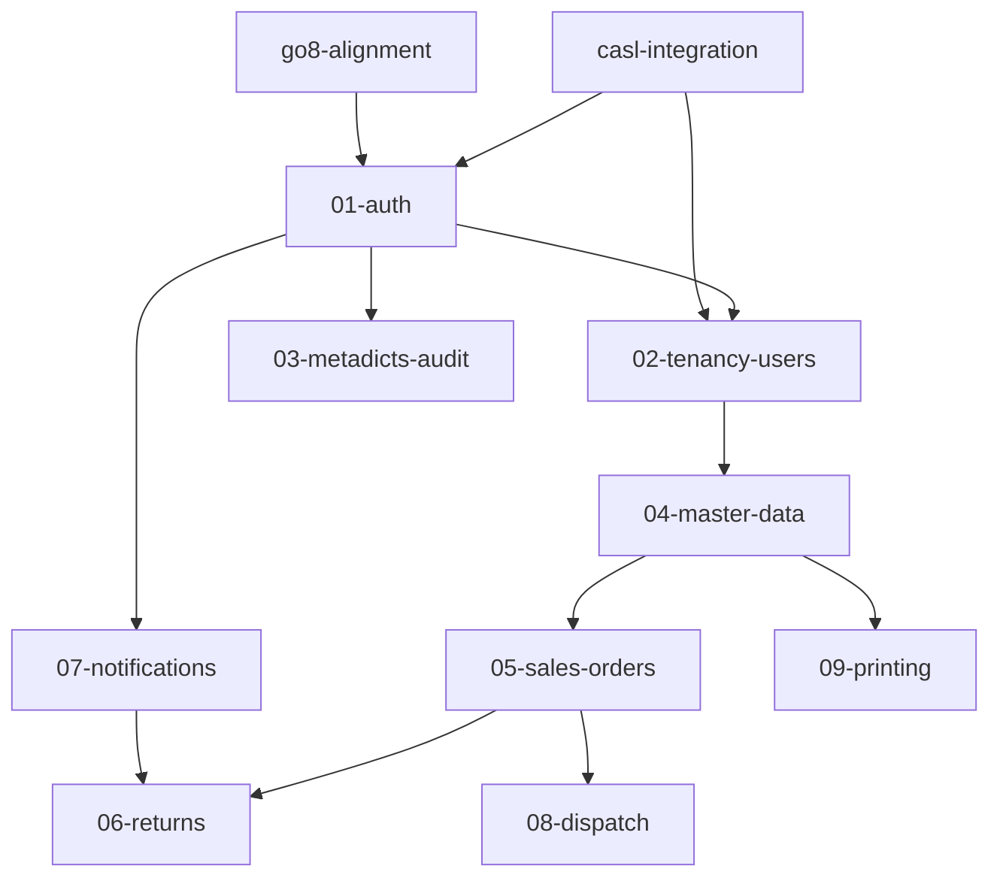

# 計畫目錄統合整理設計

> 日期：2026-08-31
> 狀態：待使用者審查
> 範圍：僅文件整理；不修改任何計畫的實質內容

## 背景與目的

`docs/superpowers/plans/` 累積 14 份計畫與 1 個細節目錄，混合主計畫、後端分域計畫、橫切修正計畫、技術選型與歷史文件，缺乏導覽與狀態追蹤。本設計產出：

1. **總索引主計畫**（`plans/README.md`）：目錄導覽 + 每份計畫摘要 + checkbox 進度 + 執行順序與依賴
2. **目錄重新分類**：混合軸線——按子專案分（backend/app），橫切與歷史文件獨立
3. **斷鏈修復**：搬移後更新所有跨文件引用（含 specs 反向引用）

## 現況事實（2026-08-31 掃描）

checkbox 進度：

| 計畫 | 進度 |
|---|---|
| 2026-08-05 主計畫（三子專案 50 Tasks） | 5/298 |
| backend-01-auth | 0/75 |
| backend-02-tenancy-users | 0/38 |
| backend-03-metadicts-audit | 0/28 |
| backend-04-master-data | 0/44 |
| backend-05-sales-orders | 0/23 |
| backend-06-returns | 0/18 |
| backend-07-notifications | 0/40 |
| backend-08-dispatch | 0/26 |
| backend-09-printing | 0/34 |
| go8-alignment | 0/38 |
| casl-integration | 0/71 |
| app-flutter-stack | 0/51 |
| 2026-07-17 原計畫 tasks | 0/407 |
| vibecheck、backend-detail/* | 無 checkbox |

引用關係：

- backend-01~09 引用 `backend-detail/0X-*.md` 與 `00-index.md`，混用 repo 根路徑（`docs/superpowers/plans/backend-detail/…`）與相對路徑（`backend-detail/…`）兩種寫法
- backend-02~09 的 Architecture 段明寫沿用 01-auth 的地基（`testutil.NewEntClient`、`middleware.Authenticate`、`audit.Recorder` 等）
- backend-06 明寫「推播採 07 計畫契約」；08 明寫與 05 同套件共用訂單狀態機；09 明寫 FileStore 由 04 Task 8 提供
- go8-alignment 修改 `backend-detail/00-index.md`、`01-auth.md`、原計畫 tasks、主計畫；casl-integration 修改 `backend-detail/01-auth.md`、`02-tenancy-users.md`、主計畫 Task 4 與多份 specs
- backend 各計畫以「原計畫 v2.9.0」稱 `2026-07-17-sales-order-1-0-tasks.md`——仍為活引用
- specs 反向引用 plans：`specs/2026-08-24-backend-go8-structure-design.md`、`specs/2026-08-24-casl-integration-design.md` 的對照表

## 目錄結構

```
docs/superpowers/plans/
├── README.md                        ← 新建：總索引主計畫
├── 2026-08-05-sales-order-1.0-subproject-implementation-plan.md   ← 主計畫留根層（跨三子專案）
├── reference/
│   └── 2026-07-17-sales-order-1-0-tasks.md          ← 原計畫，活引用
├── backend/
│   ├── 2026-08-17-backend-01-auth-plan.md
│   ├── 2026-08-17-backend-02-tenancy-users-plan.md
│   ├── 2026-08-17-backend-03-metadicts-audit-plan.md
│   ├── 2026-08-17-backend-04-master-data-plan.md
│   ├── 2026-08-17-backend-05-sales-orders-plan.md
│   ├── 2026-08-17-backend-06-returns-plan.md
│   ├── 2026-08-17-backend-07-notifications-plan.md
│   ├── 2026-08-17-backend-08-dispatch-plan.md
│   ├── 2026-08-17-backend-09-printing-plan.md
│   ├── 2026-08-24-backend-go8-alignment-plan.md     ← 純後端修正
│   └── detail/                                       ← 原 backend-detail/ 併入
│       ├── 00-index.md
│       ├── 01-auth.md
│       ├── 02-tenancy-users.md
│       ├── 03-metadicts-audit.md
│       ├── 04-master-data.md
│       ├── 05-sales-orders.md
│       ├── 06-returns.md
│       ├── 07-notifications.md
│       ├── 08-dispatch.md
│       └── 09-printing.md
├── app/
│   └── 2026-08-04-app-flutter-stack.md              ← app 技術選型
├── cross-cutting/
│   └── 2026-08-24-casl-integration-plan.md          ← 跨後端+前端
└── archive/
    └── 2026-08-03-sales-order-1.0-vibecheck-plan.md ← 歷史驗證文件
```

歸類依據：

- **go8-alignment 歸 `backend/`**：內容是後端結構對齊（D31 架構慣例、config 分檔），雖修訂主計畫與 tasks，性質屬後端
- **casl-integration 歸 `cross-cutting/`**：同時修訂後端細部文件（01-auth 1.8.1、02-tenancy-users 2.9.x）與前端 CASL ability 規則（主計畫 Task 4、WEB-INF-05），無法歸單一子專案
- **flutter-stack 歸 `app/`**：App 技術棧選型，是 app 子專案的依據文件
- **原計畫 tasks 歸 `reference/` 而非 `archive/`**：backend 計畫持續以「原計畫 Task x.y」引用
- **不重新命名任何檔案**：只搬移，把斷鏈修復範圍壓到最小
- **不建空 `frontend/`**：索引中註記「尚無前端專屬計畫」
- `.solomd/`、`.DS_Store` 不動

## 總索引主計畫（README.md）

結構：

1. **標頭**：標題 + 狀態與進度由 checkbox 掃描產生的註記 + 最後掃描日期
2. **目錄導覽**：目錄樹 + 每個目錄一段話說明放什麼
3. **執行順序與依賴**：mermaid 依賴圖 + 文字說明
4. **計畫一覽表**：計畫 | 路徑 | 範圍 | 進度 | 狀態 | 依賴
5. **狀態定義**：未開始（0%）/ 進行中（>0% 且 <100%）/ 完成（100%）

依賴圖（由計畫內文推斷）：



邏輯：go8 與 casl 修改 01/02 的計畫文件，須先落地再開始後端實作；02~09 沿用 01 地基；其餘邊依各計畫 Architecture 段明示的契約關係。

## 斷鏈修復

範圍：

1. **plans 內部互連**
   - `backend-0X-*.md`：`docs/superpowers/plans/backend-detail/…` → `docs/superpowers/plans/backend/detail/…`；相對寫法 `backend-detail/…` → `detail/…`
   - `go8-alignment`、`casl-integration` 內的 Modify 目標路徑、grep 驗證指令、commit 指令中的舊路徑
   - 主計畫、reference、app、archive 各檔對 plans 內檔案的引用
2. **specs → plans 反向引用**：`2026-08-24-backend-go8-structure-design.md`、`2026-08-24-casl-integration-design.md` 等對照表中的 `backend-detail/…` 路徑
3. **plans 外引用**：全 repo 掃描 README、`AGENTS.md`、`.solomd/` 等指向舊路徑的連結

方式：逐檔 `edit`，不用 sed 全域取代——同一路徑字串會出現在正文、code block、commit 指令中，需逐一確認語境。改完立即 grep 該舊路徑確認 0 殘留。

搬移一律 `git mv`，保留歷史。

## 驗證

1. `grep -r "backend-detail" docs/` → 0 hits
2. grep 舊根層路徑（`plans/2026-08-17-backend`、`plans/2026-08-24-backend`、`plans/2026-08-24-casl`、`plans/2026-08-04-app`、`plans/2026-08-03`）→ 0 hits
3. README.md 表格每個連結對照實際檔案存在
4. `git status` 確認搬移皆為 rename（R）而非 delete+add

## 不做的事

- 不修改任何計畫的實質內容（Task 步驟、依賴描述、版本號）
- 不重新命名檔案
- 不動 specs/ 實質內容，只修指向 plans 的路徑
- 不處理 frontend 計畫（尚不存在）
