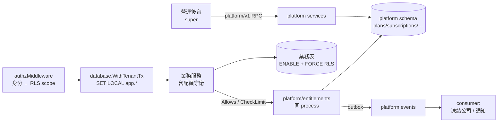

# SaaS 化：訂閱計費 × 權益控管 × 租戶隔離（設計）

> **狀態**：設計定案（2026-09-20），待實作計畫
> **範圍**：`backend/`（主）＋ `frontend/`（營運後台、租戶端權益投影）；`app/` 不在本次範圍
> **目標變更**：本專案由「單一企業自建部署（Big Bang）」改為「多租戶 SaaS 收費應用」
> **前置閱讀**：`docs/PLANNING_OVERVIEW.md`、`docs/superpowers/plans/README.md`、`backend/AGENTS.md` §8
> **參考輸入**：兩份外部 SaaS 控管架構整理（計量/權益分離、OpenFGA SaaS 授權建模）；本設計採納其「計費與權益分離」與「權限繼承」原則，**不採納**「功能即關係／webhook 寫 tuple」與「Stripe 直接照抄」（理由見 §8）

---

## 1. 決策摘要（訪談定案，2026-09-20）

| # | 決策 | 內容 |
|---|---|---|
| S1 | 租戶隔離形態 | **共用部署＋共用 DB**；`companies` 一列＝一租戶；**啟用 RLS**。大型客戶日後再加開獨立 DB |
| S2 | 計價維度 | **方案階梯（功能開關）× 席位 ＋ 資料筆數上限**；**不按量計費**（無用量事件流、無帳單引擎） |
| S3 | 收費落地 | v1 **人工收款**（匯款/月結）＋後台控管到期；發票人工開。金流（綠界/藍新/TapPay）與電子發票自動化、國際 Stripe 為**後續 adapter**，本 spec 只定升級契約 |
| S4 | 時序 | RLS 前置 → platform 薄層（entitlement）→ 05 訂單 → 平台營運 → 08/09 → 金流/發票 |
| S5 | 平台域邊界 | **邏輯分離、實體不拆**：獨立 package／proto／DB schema，介面形狀為跨服務（含 outbox 事件），同 process 實作 |
| S6 | 守衛落點 | **服務層顯式守衛**（`Allows` / `CheckLimit`）＋ RLS 當底線；不採「依 RPC 全名集中攔截的中間件」、不以 DB trigger 為主機制 |

---

## 2. 架構與邊界（含 RLS 前置）



### 2.1 位置與組裝

- 新 package：`backend/internal/platform/{plans,subscriptions,entitlements,provisioning}`
- 新 proto：`backend/proto/platform/v1/platform.proto`（`PlanService`、`SubscriptionService`）
- handler：`services.RegisterPlatformServices(apiMux, ...)`，由 `internal/server/domains.go` 的 `InitDomains()` **唯一組裝點**掛載（D31 慣例）
- DB：獨立 **`platform` schema**，migration 接在 `00021` 之後；表**不與業務表 JOIN**，只靠 `company_id` 對照

### 2.2 三種接觸面（其他一律禁止）

1. **同 process Go 介面**：`entitlement.Service{ Allows(ctx, companyID, feature); CheckLimit(ctx, companyID, feature, delta) }` —— 服務層守衛用，零延遲
2. **proto RPC**：`platform/v1` 供營運後台（僅 `super`）；租戶端只能讀自己的權益投影（見 §4.5）
3. **事件 outbox**：`platform.events`；同 process consumer 執行跨域副作用。**平台域不直接寫產品域資料**（凍結公司是事件驅動，見 §5.3）

### 2.3 RLS 前置（與平台域同批做，因為它決定查詢邊界）

現況實測：

- `internal/auth/rls.go` **已具備** `ApplyRLS` / `RLSStatements` / `WithRLS` / `RLSFrom` / `ScopeForRole`（`SET LOCAL` 語句有純函式測試）→ 缺的是**呼叫點與權限模型**
- 只有 `companies` / `departments` / `users` 三張表有 policy（`00007`），且註解明載「僅定義、不 ENABLE」
- `config/database.go` 目前**只有** `DATABASE_URL` → 需新增 `DATABASE_ADMIN_URL`
- 內嵌 OpenFGA 與業務**共用同一 datastore**（`domains.go` `mountOpenFGA` 沿用 `Database.DatabaseURL`）

**關鍵推論**：policy 是 fail-closed（GUC 未設定 → 看不到列）。故啟用 RLS 後，**未包在租戶交易內的單筆查詢不是效能問題，而是功能壞掉（黑屏）** → 所有路徑（含唯讀）都必須包。

---

## 3. 資料模型（`platform` schema）

原則：**方案是價目、訂閱是合約、期別是帳、override 是例外**。

| 表 | 關鍵欄位 | 說明 |
|---|---|---|
| `plans` | `code`(uniq)、`name`、`status`(active/archived)、`sort_order` | **不軟刪除**：被引用過只歸檔，避免歷史帳斷鏈 |
| `plan_prices` | `plan_id`、`billing_cycle`(monthly/yearly)、`base_price`、`seat_price`、`currency`、`effective_from` | 價格史；新期別取當期生效價 |
| `features` | `code`、`type`(boolean/integer)、`unit`(席/客戶/商品/部門/GB)、`description` | 可賣的功能與限額清單。**與 OpenFGA 的 resource/action 是不同軸**（誰能做 vs 買了沒有） |
| `plan_entitlements` | `plan_id`、`feature_code`、`enabled bool`、`limit_value bigint NULL` | 拆兩欄而非單一 `value text`；`limit_value IS NULL` = 不限 |
| `subscriptions` | `company_id`、`plan_id`、`seat_count`、`status`、`trial_ends_at`、`grace_until`、`dunning_attempts`、`payment_provider`、`invoice_provider`、`external_ref`、`started_at`、`cancelled_at` | 一租戶一份合約；`UNIQUE (company_id) WHERE status <> 'cancelled'`。`seat_count` **僅營運後台可調整**（租戶端只讀，避免自助改動繞過收款）；試用由營運開通時設定 `trial_ends_at`（預設 14 天） |
| `subscription_periods` | `period_no`、`period_start/end`、`plan_id`＋`unit_price`＋`seat_price`＋`seat_count`（**快照**）、`amount`、`currency`、`status`(open/paid/void)、`paid_at`、`invoice_no`/`invoice_status`/`buyer_tax_id`/`carrier`、`payment_provider`、`external_ref` | 帳的單位。`UNIQUE (subscription_id, period_no)`；`UNIQUE (payment_provider, external_ref) WHERE external_ref IS NOT NULL`（webhook 冪等） |
| `tenant_overrides` | `company_id`、`feature_code`、`enabled`、`limit_value`、`reason`、`owner`、`expires_at`、`revoked_at` | 例外唯一入口；`UNIQUE (company_id, feature_code) WHERE revoked_at IS NULL` |
| `events` | `aggregate_type/id`、`event_type`、`payload jsonb`、`dispatched_at`、`attempts` | outbox；跨域副作用由此驅動 |

### 3.1 四個「不可回填」欄位

全部落在 `subscription_periods`：**金額與幣別**、**期間起訖**、**價格快照**（`unit_price`/`seat_price`/`seat_count`，不參照 `plans` 現價）、**`provider` ＋ `external_ref`**（v1 為 `manual`／NULL）。

`status` 含 `past_due`／`grace_until`／`dunning_attempts`；人工收款時 `dunning_attempts` 恆 0 —— 這是日後接金流**不改狀態機**的關鍵（§8.2）。

### 3.2 配額計數三規則（寫入 `features.unit` 定義並由測試釘住）

1. **席位** = `users WHERE company_id=? AND deleted_at IS NULL AND status <> 'inactive'`（停用可釋放席位 → 客戶能自助降級）
2. **資料筆數**（客戶/商品/部門）只算 `deleted_at IS NULL` —— 否則刪除後仍被卡死
3. v1 直接 `COUNT(*)`（既有 `(company_id)` 索引足夠），**先不做快取**：`ponytail: 計數直查；若熱路徑延遲可感再加 Valkey 快取＋事件失效`

### 3.3 平台域的硬邊界

`platform` schema **不套 RLS**，且 **`app_rw` 對該 schema 完全無權限**（只 `GRANT` 業務 schema）；平台域走 `DATABASE_ADMIN_URL`（owner）。業務服務連「誤 SELECT 到方案表」都做不到。

平台域操作的**人可讀稽核複用既有 `audit.Recorder` / `audit_logs`**（有 `company_id` 可填目標租戶），平台域寫稽核走 admin 連線；不另立稽核表。

---

## 4. entitlement 判定與配額守衛

### 4.1 有效權益的組裝（單一來源）

```go
// platform/entitlements
Load(ctx context.Context, companyID int) (*Snapshot, error)   // plan_entitlements ⊕ 未過期 tenant_overrides ⊕ subscriptions.status
Allows(ctx context.Context, companyID int, feature string) (bool, error)
CheckLimit(ctx context.Context, companyID int, feature string, delta int) (Decision, error)
```

優先序：**未過期且未撤銷的 override（最特定）> `plan_entitlements`（方案預設）> 無訂閱時全部 `false`/`0`**（fail-closed，沒有「沒訂閱卻能用」的縫）。

### 4.2 計數的反向依賴

計數規則屬平台域，但 platform 不得 import 業務 service。沿用 repo 既有慣例（domain 宣告介面、`InitDomains()` 注入）：

```go
// platform/entitlements 宣告；實作由各業務域提供，於 server.InitDomains() 注入
type Counter interface {
    Count(ctx context.Context, companyID int, feature string) (int, error)
}
```

### 4.3 錯誤語意

| 情況 | 回應 |
|---|---|
| 額度不足 / 訂閱 `suspended` / `cancelled` | **`FailedPrecondition`**（合約狀態問題，非 `PermissionDenied`） |
| `trialing` | 允許使用；投影帶 `trial_ends_at` 供 UI 提醒 |
| 平台層身分（`super` / `developer`，`data_scope=all`） | **略過 entitlement 判斷**（平台方不受租戶合約限制）；寫死在守衛入口並有測試 |

### 4.4 快取

Valkey key `ent:{companyID}`；方案變更／override／訂閱狀態異動即 **delete**（不靠 TTL 正確性），TTL 60s 僅保底（與既有 ability 60s 慣例一致）。

### 4.5 守衛掛點清單（v1，spec 為準，漏掛即測試紅）

| RPC | 需要的權益／限額 |
|---|---|
| `UserService.CreateUser` | `limit.seats` |
| `CustomerService.CreateCustomer` / `RestoreCustomer` | `limit.customers` |
| `ProductService.CreateProduct` / `RestoreProduct` | `limit.products` |
| `CompanyService.CreateDepartment` / 部門復原 | `limit.departments` |
| 列印 / 派車 / 退貨各寫入 RPC（05/08/09 落地時） | `feature.printing` / `feature.dispatch` / `feature.returns` |

**復原也要擋**：復原會增加有效筆數，這是軟刪除設計下的專屬漏洞。boolean 功能即使未落地，`features` 清單 v1 先建好，避免日後改表。

**v1 `features` 清單（定案，不增不減）**：`limit.seats`、`limit.customers`、`limit.products`、`limit.departments`、`limit.storage_gb`（integer）；`feature.printing`、`feature.dispatch`、`feature.returns`（boolean）。`feature.printing` 等三個隨 05/08/09 落地才有守衛掛點，`limit.storage_gb` 隨 04 §3.6 檔案資產落地才有掛點，但方案與價目表 v1 就能賣。

### 4.6 UI 投影與守衛的分工

新增 `GetTenantEntitlements`（回方案、配額用量 `8/10`、試用到期）供前端 disable 與提示。**載入中或失敗 → 按鈕維持可用**，由後端擋；單一事實來源永遠在後端（與既有「前端守衛不構成授權」一致）。

---

## 5. 訂閱生命週期與凍結流程

### 5.1 複用既有公司狀態（實測）

`companies.status` enum 已是 `active / inactive / suspended`（`ent/schema/company.go:26`），且登入路徑已把 `inactive`／`suspended` 當封鎖狀態（`company_service.go:36-37`）。**欠費凍結＝設為 `suspended`，立即生效、資料全留**，不引入第二套凍結狀態。

### 5.2 狀態機

| 轉移 | 觸發者 |
|---|---|
| `trialing → active` | `RecordPayment`（人工記收款；日後金流 webhook 打**同一入口**） |
| `active → past_due` | 每日排程：`period_end` 已過且未付 |
| `past_due → active` | `RecordPayment`（補款） |
| `past_due → suspended` | 排程：逾 `grace_until`（預設 7 天） |
| `suspended → active` | `RecordPayment`（復原公司狀態） |
| 任意 `→ cancelled` | 營運後台終止（期末終止，當期不退，資料不刪） |

每次轉移寫 `platform.events`。**v1 人工收款與日後金流的差別只在「誰呼叫 `RecordPayment`」。**

### 5.3 凍結／復原走事件（前置重構）

目前「設定公司狀態」寫在 `CompanyService.UpdateCompany` 內（`company_service.go:289`），沒有可被平台 consumer 呼叫的 usecase。**前置工作**：抽出 `SetStatus(ctx, companyID, status, reason, actor)`，由 `UpdateCompany` 與平台 consumer 共用（稽核 actor = 系統、reason = 欠費）。這一步同時解掉「平台域不直寫產品域」。

- `subscription.suspended` → consumer 呼叫 `SetStatus(suspended)`（資料保留、**不軟刪除**）
- `subscription.reactivated` → `SetStatus(active)`

### 5.4 排程（新增件）

repo 目前**完全沒有** ticker／cron。新增 `cmd/platform-cron`（獨立 binary、可重跑、不與 API 生命週期綁，日後即 k8s CronJob）。冪等：同一 `(subscription_id, period_no)` 只會有一個 open 期別；轉移前檢查當前狀態，重跑不產生第二次事件。

### 5.5 期別產生與催收提醒

到期前 14/7/1 天建下一期（`status=open`）＋產出「待收款清單」。**自動通知依賴 07-notifications（未實作）** → v1 以「營運後台待辦清單＋CSV 匯出」替代，07 落地後接上（已知依賴，不假裝能做）。

### 5.6 取消語意

`cancelled` = 期末終止，期別照算到 `period_end`；資料**不軟刪除、不匯出後刪除**（SaaS 客戶回流的回復請求是常態）。

---

## 6. RLS 前置工程（落地細節）

### 6.1 角色與 DSN

- 新增 PG role `app_rw`（`NOSUPERUSER NOBYPASSRLS`、**非 table owner**）；`DATABASE_URL` 改指向它
- 新增 `DATABASE_ADMIN_URL`（owner）：goose、seed、OpenFGA、平台域使用
- 權限：`GRANT` 業務 schema 的 SELECT/INSERT/UPDATE/DELETE ＋ `ALTER DEFAULT PRIVILEGES`；**`platform` schema 一格都不授**

### 6.2 兩次 migration（先 policy 後 ENABLE，可分別回滾）

1. **補齊租戶表 policy，並修補現存缺口**：`00007` 只有 `USING`，缺 `WITH CHECK`。`USING` 管讀取與既有列，**`WITH CHECK` 才管寫入的新列** —— 缺它意味著「可以把列寫成別的 `company_id`」。新 policy 一律 `FOR ALL ... USING (...) WITH CHECK (...)`，既有三張核心表一併補。
2. `ENABLE ROW LEVEL SECURITY`，並對**業務表加 `FORCE`**（`FORCE` 只作用於被 ENABLE 的表，OpenFGA 自有表不在其中，故安全且更硬——連誤用 owner 連線查業務表也受約束）。`platform` schema 不套 RLS。

**租戶表判準**：凡有 `company_id` 欄位者即租戶表 → 必須有 policy 且 ENABLE。無租戶欄位者（`roles`、`role_permissions`、metadicts 系統預設列、`goose_db_version`）沿用 `00007` 的「已設定身分即可讀」許容政策。`audit_logs` 有 `company_id` → 租戶表；平台域寫稽核走 admin 連線。

### 6.3 查詢路徑全包（含唯讀）

新增單一入口 `database.WithTenantTx(ctx, client, fn)`：開交易 → `auth.ApplyRLS` → 執行 fn → commit/rollback。服務內既有的 `client.Tx(ctx)` 與直呼查詢全數遷移。**唯讀也必須包**（否則 fail-closed 黑屏）。「寫入路徑必包租戶交易」寫進 `backend/AGENTS.md` 慣例（沿用本 repo 將分頁 tie-break 寫成慣例的先例）。

### 6.4 營運後台不靠 `scope=all` 掃業務表

平台方跨租戶視圖（租戶列表、用量統計、待收款清單）走**平台域 admin 連線＋投影查詢**，不開「`super` 用 `data_scope=all` 讀所有租戶業務資料」這條路。理由：那條路一旦存在，就沒有任何機制區分「平台方合法維運」與「越權撈資料」，也讓 RLS 的意義被自家後台抵銷。

### 6.5 回滾性質

`Down` 必含 `DISABLE ROW LEVEL SECURITY` 與 `DROP POLICY`（`migrate down` 在 2026-09-20 才修成可完整回滾，不得打破）。

---

## 7. 測試策略與驗收

### 7.1 單元（sqlite enttest，離線必綠）

entitlement 組裝（方案 ⊕ override ⊕ 訂閱狀態、過期 override 失效、無訂閱 → 全 false/0）、配額計數三規則、訂閱狀態機轉移表（合法與非法）、金額公式（方案費＋席位單價×席位，月/年）。

**RLS 相關一律不用 sqlite**：enttest 不支援 `SET` / `FORCE`，這是本 repo 已吃過的同型陷阱（同值群排序在 sqlite 穩定、真 PG 才會跨頁重複/遺漏）。

### 7.2 整合（testcontainers 真 PG，`//go:build integration`）

1. **未設 GUC → 0 列**（fail-closed 正面證明）
2. **跨租戶寫入嘗試被 `WITH CHECK` 擋**：此測試**先寫成會紅**，再修 `00007` 缺口，紅轉綠即完成證據
3. **跨租戶可見集合探針**：以 A 公司身分掃每個租戶端點，斷言只看得到 A（既有「逐頁掃描 == 單次全量」樣板的擴充）
4. **配額競態**：兩個並行請求搶最後一個席位 → 只有一個成功。做法：對 `subscriptions` 列 `SELECT ... FOR UPDATE`（或等價鎖協定）；只 `COUNT` 會兩個都過
5. **`migrate up/down` 完整回滾**

### 7.3 守衛清單機械化

spec 內建表（§4.5）「RPC → 需要的 feature/限額 → 對應測試」，以**表驅動測試**逐項驗證真的會擋。這把「不會漏掛」從紀律變成 CI 可驗，且同時涵蓋 boolean 與數值語意（中間件方案做不到）。

### 7.4 驗收（DoD）

- `task check`、`task test:integration` 全綠
- 前端 `typecheck｜lint｜test｜build` 全綠；CI 四 job 全綠
- 人工走完：**開通 → 記收款 → 逾期 `past_due` → 寬限後 `suspended`（登入被擋、資料還在）→ 補款復原**

---

## 8. 決策與文件變更

### 8.1 決策記錄（`2026-07-19-sales-order-1.0-decisions.md`）

- **新增** D34：SaaS 商業模式（共用部署＋RLS、方案階梯×席位、不按量計費）
- **新增** D35：platform 域邏輯分離（介面跨服務、實體不拆）
- **新增** D36：RLS 啟用（`app_rw` 非 owner、業務表 `ENABLE` + `FORCE`、補 `WITH CHECK`）
- **新增** D37：人工收款 v1 與金流/發票升級契約
- **修訂** D12：不存金額**縮到業務域**，平台計費域例外（價格/帳單/付款/折讓屬平台域）
- **修訂** D2：Big Bang → 分階段；自助/試用/凍結/復原為常態
- **修訂** D3：RLS 由「僅定義」改為已 ENABLE 完成

### 8.2 為何以 adapter 承載升級（不照抄外部建議）

- **不採「功能即關係／webhook 寫 OpenFGA tuple」**：付費功能是**租戶級**事實。升級一次要對全公司每個 user 寫/刪 tuple → O(users) 寫擴散、store 膨脹，且與既有 `authz.Provision`（`role_permissions` → tuple）互相競態。entitlement 留在 Postgres（單列查詢、可稽核、可 override）＋ Valkey 快取。
- **不採 Stripe 直接照抄**：台灣中小企業場景下**統編／統一發票是法遵**，Stripe TW 開不出統一發票 → 需第三方加值中心或人工開票。
- **升級契約**：`payment_provider` / `invoice_provider` 決定 adapter；帳務以**訂閱期**為單位；一租戶同時僅一個 active provider（避免雙重扣款）；金流 webhook 與人工操作都收斂到 `RecordPayment`；`external_ref` 唯一鍵擋 webhook 重送；發票分 `tw_einvoice` 與 `stripe_invoice` 兩種實作。

### 8.3 規格書

`docs/superpowers/specs/2026-07-16-sales-order-1.0-design.md` 升版 **v1.0.34 → v1.1.0**：新增平台域章節、租戶生命週期、計費與權益。

---

## 9. 範圍邊界

**In**：① RLS 前置（角色/DSN、policy 補 `WITH CHECK`、ENABLE + FORCE、`WithTenantTx` 遷移）② `platform` schema ＋ entitlement ＋ 服務層守衛 ③ 平台營運（`platform/v1` RPC；UI 後補，v1 以 `super` ＋ seed/CLI 操作）④ 05 訂單**只需**守衛介面接點

**Out（本 spec 不含）**：05 訂單本體（依原 05 計畫）、08 派車、09 列印、07 通知、04 殘項（3.5/3.6/3.8）、電子發票實作、金流 adapter 實作、自助註冊與試用申請流程（v1 由營運開通）、k8s 部署與備份（D19）、`app/` 任何改動

## 10. 風險

| # | 風險 | 對策 |
|---|---|---|
| R1 | 啟用 RLS 後漏包交易的路徑直接黑屏（功能故障） | `WithTenantTx` 單一入口 ＋ 整合測試「未設 GUC → 0 列」＋ 慣例化 |
| R2 | 配額競態（並行搶最後一個席位） | `subscriptions` 列 `FOR UPDATE` ＋ 併發整合測試 |
| R3 | `WITH CHECK` 缺口若未補，RLS 看似生效實則可跨租戶寫入 | 先寫會紅的測試，紅轉綠才收工 |
| R4 | `platform` 域與業務域的跨域一致性（凍結延遲視窗） | 同 process 呼叫（零視窗）；事件僅作為解耦介面，日後拆服務時才需處理延遲 |
| R5 | 人工收款階段的催收提醒缺自動通知（07 未實作） | v1 以營運後台清單＋CSV 匯出替代，明確列為依賴 |
| R6 | 計數直查在熱路徑的延遲 | `ponytail:` 標記留痕；延遲可感再加快取＋事件失效 |

---

*建立：2026-09-20（SaaS 化設計定案；目標由單一企業自建部署改為多租戶收費應用）*
